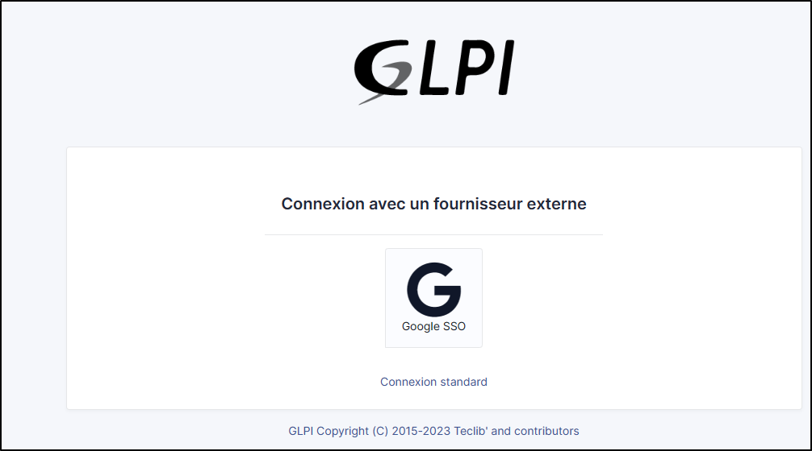

Google
------

Creating a project
~~~~~~~~~~~~~~~~~~

-  From your `Google console <https://console.cloud.google.com/>`_ (administrator access is required)
-  Go to your organisation then new project
-  Enter the name of your project
-  Click on **Create**

   .. figure:: images/oauth-sso-google-2.png
      :alt: add project
      :scale: 100 %

-  Return to your organisation,
-  Select your project

   .. figure:: images/oauth-sso-google-3.png
      :alt: select the project
      :scale: 55 %

Setup Oauth access
~~~~~~~~~~~~~~~~~~~~~~~

-  From the menu, click on **APIs & Services**
-  Then **OAuth consent screen**

   .. figure:: images/oauth-sso-google-4.png
      :alt: add API
      :scale: 100 %

-  Select the type of access that will be granted to the application (internal or external users)
-  Then click on **Create**.

   .. figure:: images/oauth-sso-google-5.png
      :alt: user type
      :scale: 100 %

-  Enter (as a minimum) a name for the application, an email address for application support and the developer’s email address (this information is compulsory).
-  Click on **Save and continue**.

-  In the **Scope** section
-  Click on **Add or remove application fields**
-  Add **auth/userinfo.email** **auth/userinfo.profile** and **openid**

   .. figure:: images/oauth-sso-google-6.png
      :alt: update scopes
      :scale: 100 %

-  Click on **Update**
-  Then **Save and continue**

ID settings
~~~~~~~~~~~

-  From the **Credentials** menu
-  Click on **Create credentials**
-  Then **Oauth client ID**.

   .. figure:: images/oauth-sso-google-7.png
      :alt: add credentials
      :scale: 70 %

-  Select the type of application **Web application**
-  Enter an application name
-  In the **Authorized redirect URIs** section
-  Enter the GLPI **Callback URL**

.. tip::
   Where can I find my callback URL?

   .. figure:: images/oauth-sso-google-8.gif
      :alt: find url callback
      :scale: 35 %

-  Click on **Create**
-  A page appears with the identifier values. **Keep this information** as it will be requested in GLPI.

   .. figure:: images/oauth-sso-google-9.png
      :alt: Overview
      :scale: 100 %

Setup GLPI
~~~~~~~~~~

-  From **Setup > Oauth SSO applications**
-  Click on **Add**
-  Select **Google** in the **Oauth provider** field
-  Select the icon that will be visible on the home page
-  Enter the **Client ID** (number 1 on the previous screenshot)
-  Enter the **Client secret** (numbered 2 on the previous screenshot)
-  Enter the **field user ID**  [1]_

   .. figure:: images/oauth-sso-google-10.png
      :alt: setup GLPI
      :scale: 40 %

-  Click on **Add**

From the home page, the new Oauth SSO login option will be visible:

.. note::
   The first time a user logs on, they will be asked to accept access authorisations for their profile

.. [1]
   the identifier field will be the user’s login. **Google user Id** represents the unique value for each user generated when the user is created.
