Keycloak
--------

Create a REALM
~~~~~~~~~~~~~~

-  After installing keycloak, go to the admin console:

http://XXXXXXXXXX:8080/admin or https://XXXXXXXXXX:8080/admin

- Create your **realm** by clicking on **master** at the top left of your screen
- Then **create Realm**
- Give it a name that suits you
- Click on **Create**

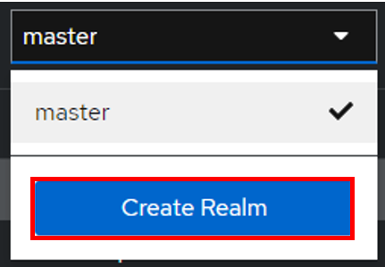

Create user
~~~~~~~~~~~

-  Then go to the **Users** tab
-  Then **Create new user** (we’ll use a local user, but you can synchronize your LDAP if necessary)

.. figure:: images/keycloak-3.png
   :alt: create user
   :scale: 100 %

-  Create your user according to your needs, remembering to check the Email verified box
-  Click on **Create** once you’ve entered your details.

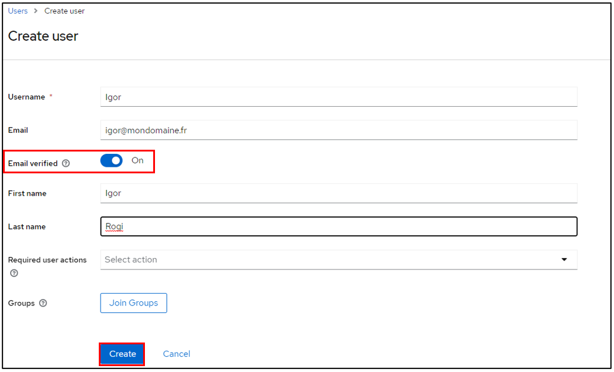

-  Stay in your user file and click on **Credentials**
-  Then **Set pasword**

.. figure:: images/keycloak-5.png
   :alt: add credentials
   :scale: 70 %

- Configure the user password, taking care to indicate that the password is not temporary
- Click on save then **Save password**

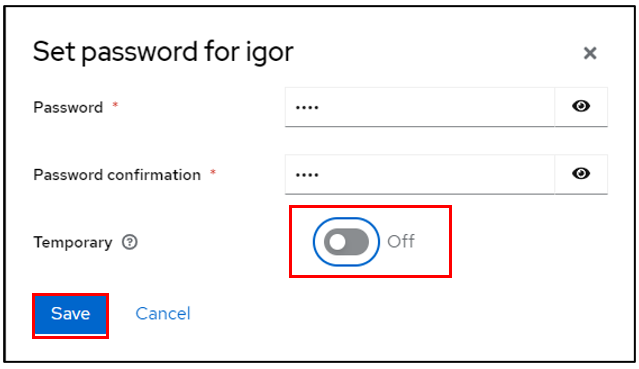

You can check that your configuration is correct by logging on to the user account console:

http://XXXXXXXXXXX/realms/GLPI/account/#/ or
https://XXXXXXXXXXX/realms/GLPI/account/#/

(Remember to adapt the realm name if you haven’t named it GLPI).

You will then be able to connect to the record of the previously created user or one of your LDAP users.

Create client
~~~~~~~~~~~~~

Now we can register our GLPI application with Keycloak

- Go to **Clients**
- Create client

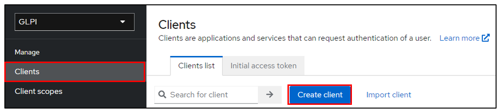

- Give your application a client ID, which you’ll need to pass on to your GLPI Oauth SSO configuration
- Click on next and make sure on the next page that the **standard flow** and **client authentication** options are active
- Click on **Save**

Keep this page active, we’ll come back to it later.

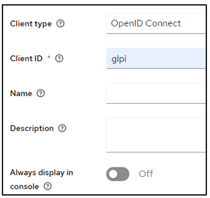

Setup GLPI
~~~~~~~~~~

- Go to GLPI
- In **Setup > Oauth SSO applications click on add** (at the top of your screen)

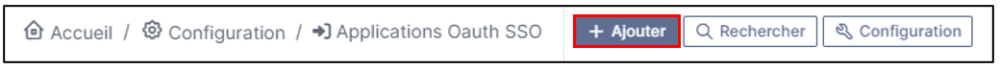

- Start by retrieving the return URL and pasting it into Keycloak’s **valid redirect URIs** field

.. figure:: images/keycloak-11.png
   :alt: copy URL callback
   :scale: 90 %

- Back in GLPI’s Oauth SSO plugin configuration, fill in the required fields:

.. figure:: images/keycloak-12.png
   :alt: setup GLPI
   :scale: 90 %

1. Give your provider a name, which will appear on the login page for users

2. Activate this plugin so that it is visible and usable on the login page

3. Choose Keycloak as your Oauth provider

4. Enter the client name set above

5. Retrieve client secret from Keycloak (client, client_name, credentials)

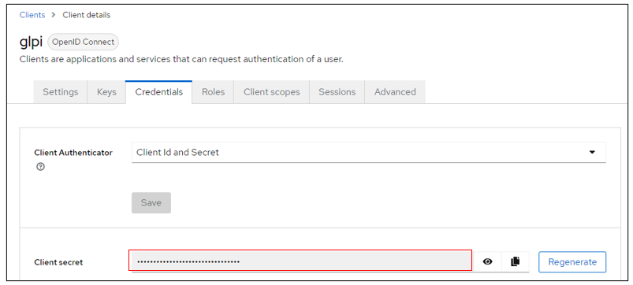

6. Enter the discovery URL: http://mondomaine/realms/monrealms/.well-known/openid-configuration.

- Click on **Add**

In the plugin, to see the approval message:

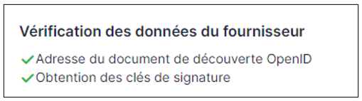

Now that configuration is complete, you can test the connection with the user you created earlier, or with your LDAP user.

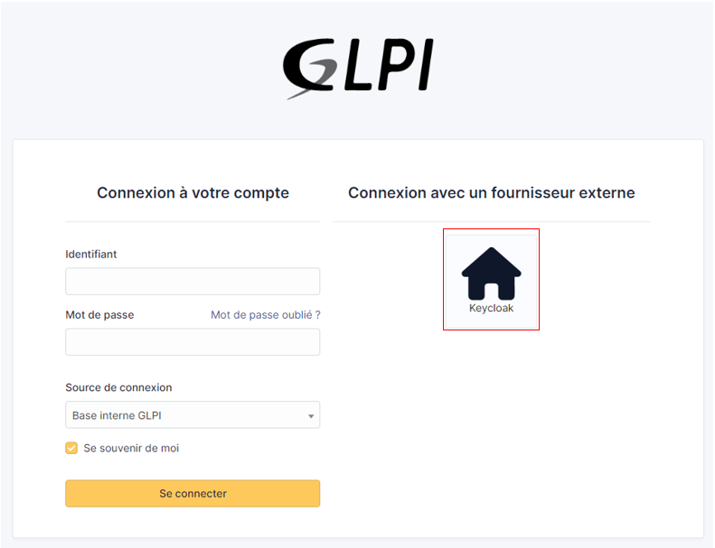

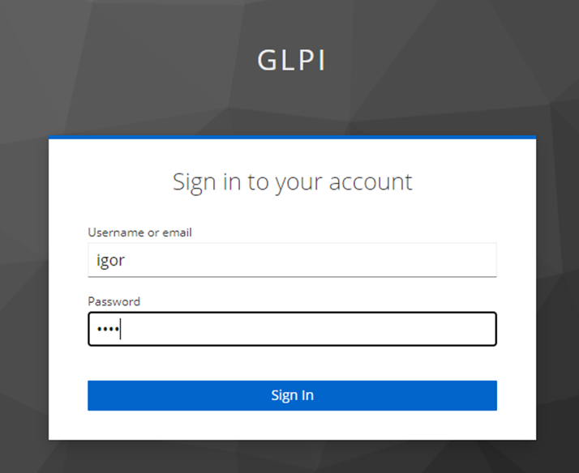

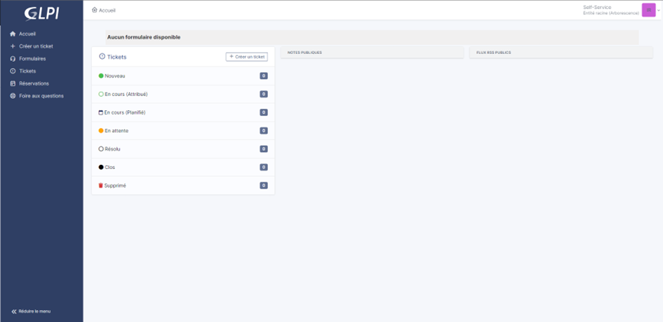