OKTA
----

Create application
~~~~~~~~~~~~~~~~~~

-  First, go to GLPI and download the Oauthsso plugin
-  Navigate to the **Setup > Oauth SSO applications**
-  Click on **Add**

-  Keep this window active and retain the callback URL :

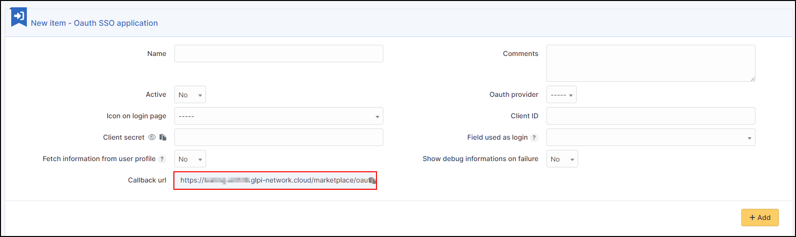

-  In your OKTA interface, go to **Applications**
-  **Create App Integration**

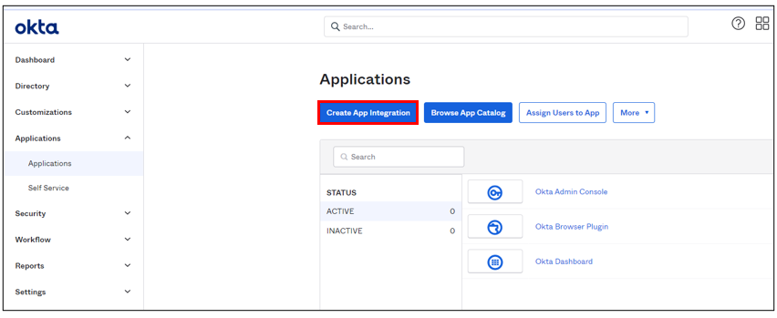

-  Select option **OIDC – OpenID Connect** in the 1st insert and **Web Application** in the second
-  Click on **Next**

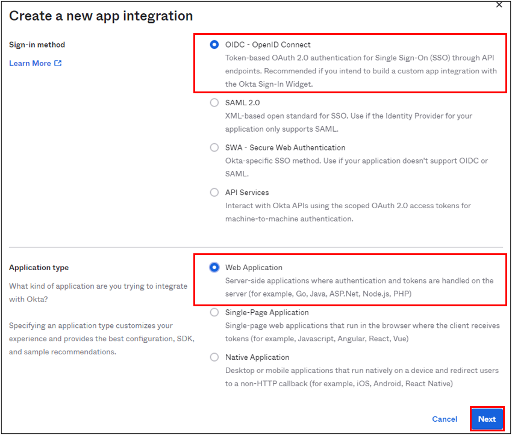

-  Enter an application name and check the box **Client credentials**

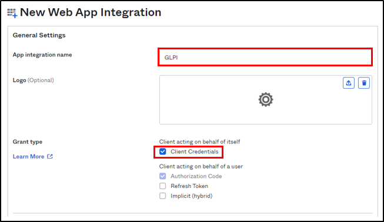

-  Enter the return URL, retrieved above, in Sign-in redirect URIs.

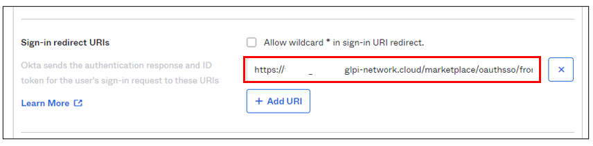

Assignments
~~~~~~~~~~~

-  In the last box, select the option that suits you best (here we authorize all users present in OKTA)
-  Finally, click on **Save**

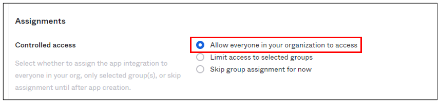

Setup GLPI
~~~~~~~~~~

-  In GLPI, go back to the Oauth SSO plugin configuration window and enter your OKTA tenant information :

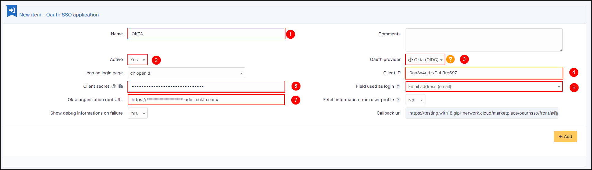

1. Give your provider a name, which will appear on the login page.

2. Indicate this as active

3. Enter OKTA as provider Oauth

4. Enter the application ID found in the application previously created in OKTA

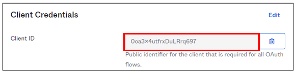

5. Specify the ID field to be mapped with OKTA

6. Specify the customer secret available in OKTA in the previously created application

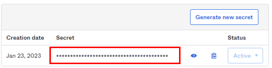

7. Enter the name of your OKTA instance (https://XXXXXXXXX.okta.com), available in the account creation confirmation e-mail.

- Click on **Add**
- In the plugin, you will see the approval message:

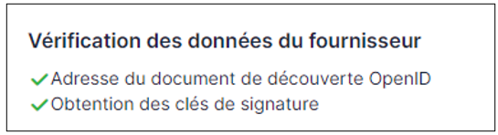

Now that the configuration is complete, you can test it with a user.

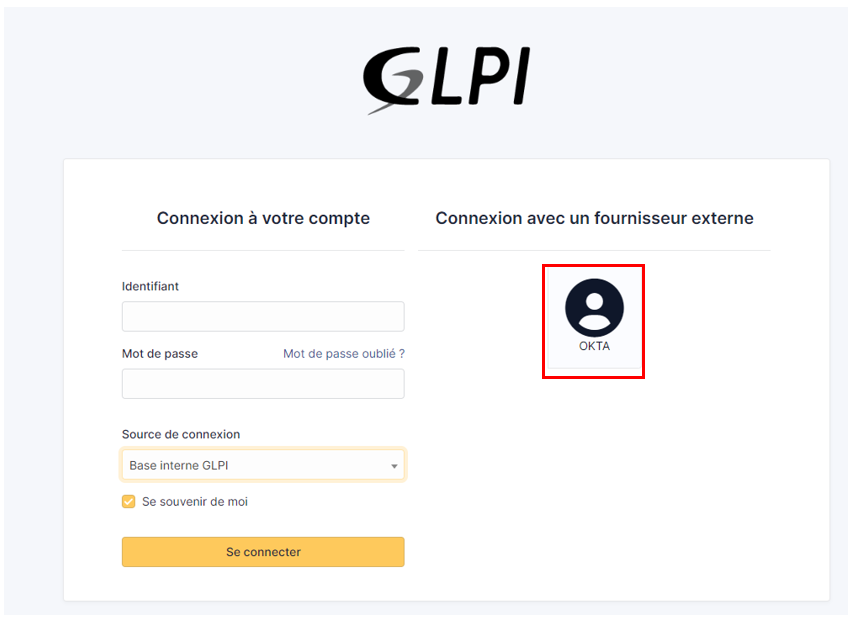

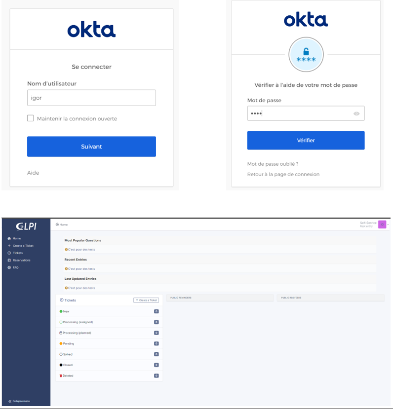
