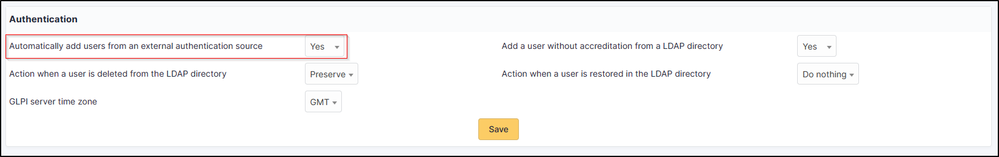

Requirements (on-premise)
-------------------------

============ =========== ===========
GLPI Version Minimum PHP Recommended
============ =========== ===========
10.0.x       8.1         8.2
============ =========== ===========

.. include:: ../include/basic_subscription.rst

External Authentication
-----------------------

The plugin uses GLPI’s **External Authentication** functionality and to be functional, it needs some initial Setup.

-  Go to **Setup > Authentication > Other authentication methods**
-  In the **Other authentication transmitted in the HTTP request** section
-  The **Storage fields for the identifier in the HTTP request** field must be defined, usually **HTTP_AUTH_USER**.
-  The **Delete the domain from identifiers of the form identifier@domain** field can be set to **Yes** or **No**.

.. Note::
   In the case of authentication via SSO, the option **Delete the domain of identifiers in the form identifier@domain** can be set to **Yes**, which will allow 2 user records to be merged if they are already present in the database (internal or LDAP(S)).

   .. warning::
      Be careful because this option is subject to identity theft. If your application is open to users other than your own, it is possible that one user could be merged with another.
      For example, **john.doe@mondomaine.fr** has a namesake but a different email address **john.doe@unautredomaine.fr**. By deleting the domain, the 2 records will be merged and the John Does will have the same account.

The users who are going to authenticate themselves will not be known to GLPI, so it is necessary to populate certain fields to create their record in GLPI with a minimum of information.

The fields that can be retrieved by SSO are as follows:

-  Last name : **givenName**
-  First name: **familyName**
-  Email: **email**
-  Email2: **email2**
-  Telephone number: **phone**
-  Mobile: **mobile**
-  Title: **title**
-  Language: **language**

.. figure:: images/oauhtsso-3.png
   :alt: field to complete
   :scale: 45 %

-  Save your Setup

You must also activate the automatic addition of users in GLPI to create them in GLPI at the time of authentication

- In the **Setup > Authentication > Setup** menu
- The **Automatically add users from external authentication sources** field must be changed to **Yes**

Fetch information from user profile option
------------------------------------------

You can choose if you want to retrieve informations from the user profile. In **setup > Oauth SSO applications** select yes or no as required.

.. Important::

   If **OAuth SSO** is your **only source of authentication AND provisioning**, we recommend that you set the **Fetch information from user profile option** to **Yes**
   so that user information can be fetched. Please note that claims must also be set correctly on the provider side.

   If you are using an **external provisioning source** such as SCIM, we recommend that you set the **Fetch information from user profile option** to **No**
   so that user information is not overwritten and replaced by that of the OAuth SSO plugin.