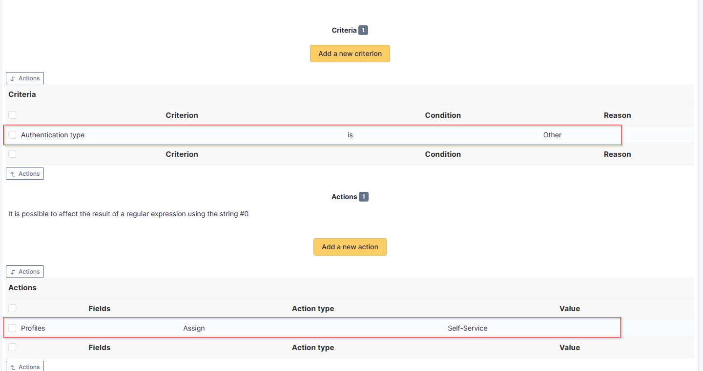

Rules for assigning authorisations
----------------------------------

Remember that Oauth SSO authentication allows **only authentication**, in the sense that no user management is carried out following authentication.

In most cases, it will therefore be necessary to establish rules for assigning authorisations to your users (to give them a profile, for example).

-  To do this, go to **Administration > Rules > Rules for assigning authorisations to a user**.

There are no ‘mandatory’ rules, it’s up to you to create the rule(s) that you feel best suit your needs according to your available criteria.

For example, a very simple rule

-  A very simple rule -> *I want my users with SSO authentication to obtain the Self-Service profile*.

So I set my criteria and my action :

