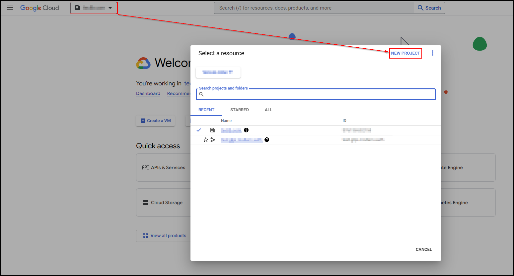
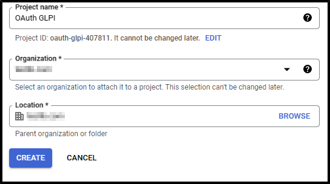
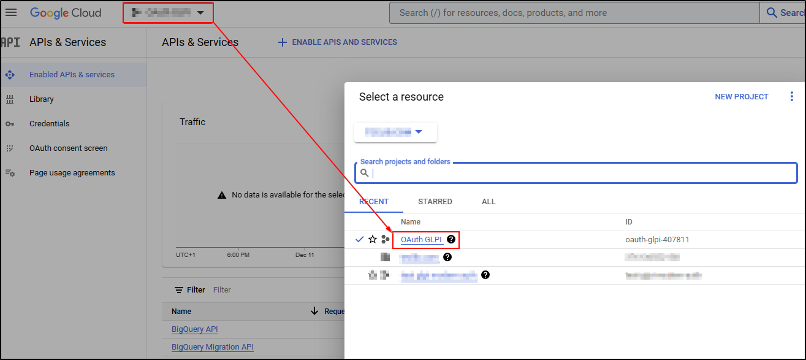
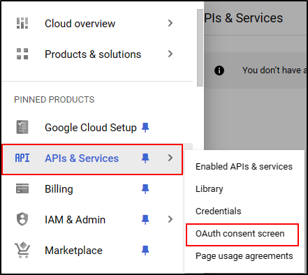
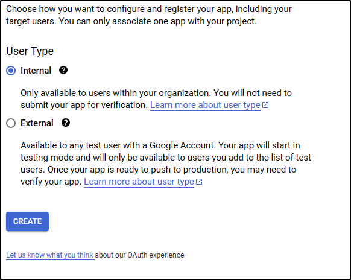
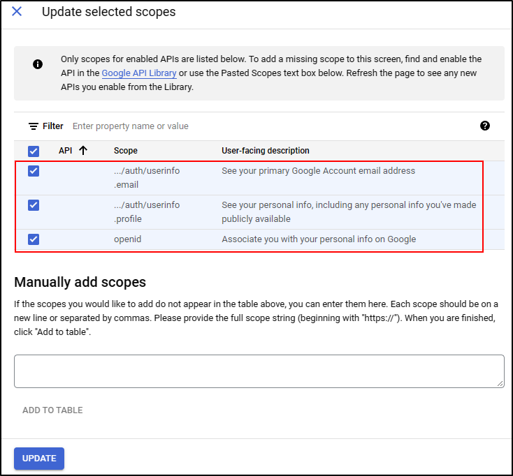
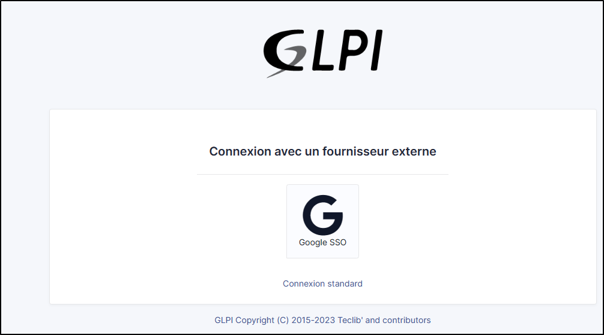

 etup OAuth SSO with Google
======================================

Requirements (on-premise)
-------------------------

============ =========== ===========
GLPI Version Minimum PHP Recommanded
============ =========== ===========
10.0.x       8.1         8.2
============ =========== ===========

.. note::
   A `basic licence <https://services.glpi-network.com/#offers>`__ (or higher) is required. This plugin is also available from the `Cloud <https://glpi-network.cloud/>`__.

Install the OAuth SSO application
---------------------------------

-  From **setup > plugins**
-  Install **Oauth SSO**

.. figure:: images/oauth-sso-google.png
   :alt:

Creating a project
------------------

-  From your `Google console <https://console.cloud.google.com/>`__ (administrator access is required)
-  Go to your organisation then new project

-  Enter the name of your project
-  Click on **create**

-  Return to your organisation
-  Select your project

Setting up Oauth access
-----------------------

-  From the menu, click on **APIs & Services**
-  Then **OAuth consent screen**

-  select the type of access that will be granted to the application (internal or external users)
-  Then click on **create**

-  Enter (as a minimum) a name for the application, an email address for application support and the developer’s email address (this information is compulsory)
-  Click on **save and continue**
-  In the **scope** section, click on **add or remove application fields**
-  Add **auth/userinfo.email** **auth/userinfo.profile** and **openid**

-  Click on **update**
-  Then **save and continue**

Setting up ID and credentials
-----------------------------

-  From the **credentials** menu
-  click on **create credentials** and then **Oauth client ID**

   .. figure:: images/oauth-sso-google-7.png
      :alt:

-  Select the type of application **web application**
-  Enter an application name
-  In the **Authorized redirect URIs** section, enter the GLPI **callback URL**

..Tip::
   Where can I find my callback URL?
   .. figure:: images/oauth-sso-google-.gif
   :alt:

-  Click on **create**

-  A page appears with the identifier values. **Keep this information**
   as it will be requested in GLPI.

   .. figure:: images/oauth-sso-google-9.png
      :alt:

Setting up GLPI
---------------

-  From **setup > Oauth SSO applications**
-  Click on **add**
-  Select **Google** in the **Oauth provider** field
-  Select the icon that will be visible on the home page
-  Enter the **client ID** (number 1 on the previous screenshot)
-  Enter the **client secret** (numbered 2 on the previous screenshot)
-  Enter the **field user ID**  [1]_

   .. figure:: images/oauth-sso-google-10.png
      :alt:

-  Click on **add**

From the home page, the new Oauth SSO login option will be visible:

..info::
   Access authorisation” The first time a user logs on, they will be asked to accept access authorisations for their profile

.. [1]
   the identifier field will be the user’s login. **Google user Id** represents the unique value for each user generated when the user is created.

