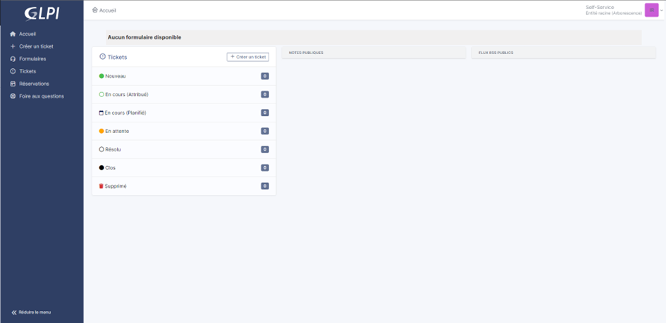

OAuth SSO with Keycloak
=======================

Requirements (on-premise)
-------------------------

============ =========== ===========
GLPI Version Minimum PHP Recommanded
============ =========== ===========
10.0.x       8.1         8.2
============ =========== ===========

.. note::
   A `basic licence <https://services.glpi-network.com/#offers>`__ (or higher) is required. This plugin is also available from the `Cloud <https://glpi-network.cloud/>`__.

Create application Keycloak
---------------------------

Create REALM
~~~~~~~~~~~~

Since the 1.9.0 update of the oauthsso plugin, Keycloak integration is now possible. Here are the steps to follow to configure it correctly (this procedure was carried out using a test infrastructure. For production use, please refer to the official KeyCloak documentation
https://www.keycloak.org/guides#server).

-  After installing keycloak, go to the admin console:

http://XXXXXXXXXX:8080/admin or https://XXXXXXXXXX:8080/admin

- Create your **realm** by clicking on **master** at the top left of your screen
- Then **create Realm**
- Give it a name that suits you,
- Then click on **create**

.. figure:: images/keycloak-2.png
   :alt:

Create a user
~~~~~~~~~~~~

-  Then go to the **Users** tab
-  **create new user** (we’ll use a local user, but you can synchronize your LDAP if necessary)

.. figure:: images/keycloak-3.png
   :alt:

-  Create your user according to your needs, remembering to check the Email verified box
-  Click on **Create** once you’ve entered your details

.. figure:: images/keycloak-4.png
   :alt:

Setup credentials
~~~~~~~~~~~~~~~~~

-  Stay in your user file and click on **credentials**
-  then **set pasword**

.. figure:: images/keycloak-5.png
   :alt:

Configure the user password, taking care to indicate that the password is not temporary
- Click on **save**
- Then **save password**

.. figure:: images/keycloak-6.png
   :alt:

Check your configuration
~~~~~~~~~~~~~~~~~~~~~~~~

You can check that your configuration is correct by logging on to the user account console:

http://XXXXXXXXXXX/realms/GLPI/account/#/ or
https://XXXXXXXXXXX/realms/GLPI/account/#/

(Remember to adapt the realm name if you haven’t named it GLPI).

You will then be able to connect to the record of the previously created user or one of your LDAP users.

Add an application
~~~~~~~~~~~~~~~~~~

Now we can register our GLPI application with Keycloak

- Go to **clients**
- Then “create **client**

.. figure:: images/keycloak-7.png
   :alt:

- Give your application a client ID, which you’ll need to pass on to your GLPI Oauth SSO configuration
- Click on **next** and make sure on the next page that the **standard flow** and **client authentication** options are active
- Click on **save**

- Keep this page active, we’ll come back to it later.

.. figure:: images/keycloak-8.png
   :alt:

Setup GLPI
----------

Download the plugin
~~~~~~~~~~~~~~~~~~~

- Go to GLPI and download the Oauthsso plugin if you haven’t already done so.

Add your new OAuth SSO
~~~~~~~~~~~~~~~~~~~~~~

- In **configuration > Oauth SSO applications** click on add (at the top of your screen)

.. figure:: images/keycloak-10.png
   :alt:

- Start by retrieving the return URL and pasting it into Keycloak’s **valid redirect URIs** field

- Back in GLPI’s Oauth SSO plugin configuration, fill in the required fields:

.. figure:: images/keycloak-12.png
   :alt:

1: Give your provider a name, which will appear on the login page for users

2: Activate this plugin so that it is visible and usable on the login page

3: Choose Keycloak as your Oauth provider

4: Enter the client name set above

5: Retrieve client secret from Keycloak (client, client_name, credentials)

.. figure:: images/keycloak-13.png
   :alt:

6: Enter the discovery URL:
http://mydomain/realms/monrealms/.well-known/openid-configuration.

Click on **add**. In the plugin, to see the approval message:

Now that configuration is complete, you can test the connection with the user you created earlier, or with your LDAP user.

.. figure:: images/keycloak-15.png
   :alt:

.. figure:: images/keycloak-16.png
   :alt:

References
----------

- `Documentation “Oauth SSO client for GLPI” <https://services.glpi-network.com/documentation/1731/file/README.md>`__
- `Documentation Keycloak “Manage OpenID Connect and SAML clients” <https://www.keycloak.org/docs/latest/server_admin/#_oidc_clients>`__
