Order
=====

Sources
-------

* Sources link: https://github.com/pluginsGLPI/order
* Download: https://github.com/pluginsGLPI/genericobject/order

Requirements (on-premise)
-------------------------

============ =========== ===========
GLPI Version Minimum PHP Recommended
============ =========== ===========
10.0.x       8.1         8.2
============ =========== ===========

.. Note::
   This plugin is available without a GLPI-Network subscription. It is also available in `Cloud <https://glpi-network.cloud/>`__

Features
--------

This plugin supports the following aspects of order management :

* Definition and management of a catalogue of product references
* Order management (with approval workflow)
* Budgets management
* Management of invoices associated with orders

Install the Plugin
------------------
* Uncompress the archive.
* Move the ``order`` directory to the ``<GLPI_ROOT>/plugins`` directory
* Navigate to the *Configuration > Plugins* page,
* Install and activate the plugin.

Configuration
-------------

You will access the plugin configuration from the *Setup* > *Plugins* > *Orders managment*.

When the plugin is installed and enabled, the following options are available:

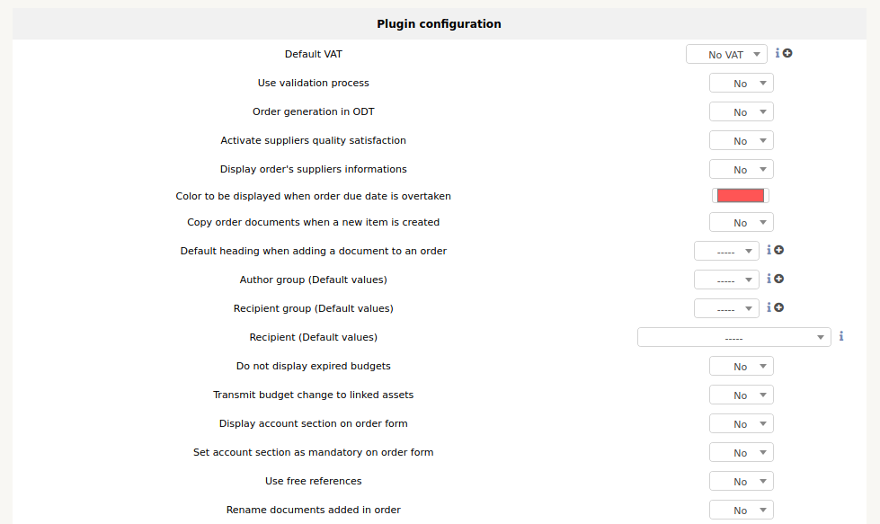

* Default VAT: indicates the amount of VAT that will be proposed by default in the plugin
* Use the validation process: indicates whether the full validation circuit should be used, or whether anyone can validate applications.
* Purchase order generation: indicates if the tab allowing the generation of a purchase order in ODT format is displayed or not.
* Enable supplier quality: indicates whether the tab for judging supplier satisfaction is displayed once the order is delivered.
* Display purchase order vendor information: Shows whether or not the tab for storing the reference and vendor purchase order number is displayed.
* Colour when the estimated delivery date is exceeded: colour of display in the search engine of an undelivered order for which the estimated delivery date is exceeded
* Copy order documents when a new item is created : Copy order documents to generated item
* Default heading when adding a document to an order : define default heading
* Author group (Default values) : Define default author
* Recipient group (Default values) : Define defaut Recipient group
* Recipient (Default values) : Define default Recipient
* Do not display expired budgets : yes or no
* Transmit budget change to linked assets : yes or no
* Display account section on order form : yes or no
* Set account section as mandatory on order form : yes or no
* Use free references : yes or no
* Rename documents added in order :yes or no

Automatic actions when delivery Item
^^^^^^^^^^^^^^^^^^^^^^^^^^^^^^^^^^^^

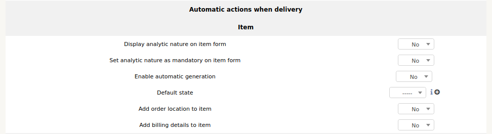

Generation does not apply to contracts, cartridges and consumables.
In order to activate this feature, change the option Activate automatic generation to yes and validate.
During the generation, the material will be created with some randomly generated information:

* Default name
* Default Serial Number
* Default inventory number
* If a template is associated with the part number, and in this template the name and serial number are generated, then the settings defined above for these 2 fields do not apply.

The default status will be set when the material is created.
The positioning of the status during the creation of the material can lead to a date filling of the financial information. See the Entity Inventory tab.

Order lifecycle
^^^^^^^^^^^^^^^

You can define your own status for order lifecycle

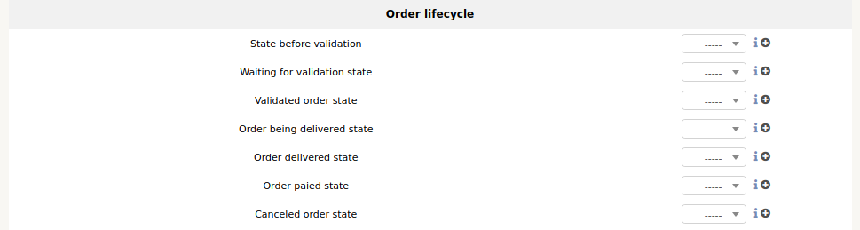

Creation of a reference catalogue
---------------------------------

You will access the reference catalogue from the *Management* > *Orders* > *Products references*.

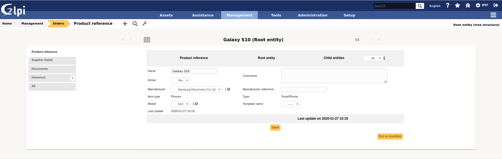

The creation of product references is the prerequisite for order management.
Any product to be ordered must be referenced in the plugin catalog.
When creating a product reference, the following fields must be filled in:

* Sub-entities: indicates if the reference will be visible in the current entity only or in the sub-entities as well.
* Name: name of the reference, as it will be displayed when managing an order (required)
* Manufacturer: the manufacturer of the product (not the supplier)
* Type of equipment: indicates what type of equipment we are dealing with
* Type: the type of the product
* Model: the model of the product
* Template: the GLPI template of the product if one already exists.
* comments: additional information on the reference
* Once the reference is created, it is then necessary to indicate from which supplier(s) the product is available, as well as the price associated with it.

It is also possible to :

* Add related documents
* View history

Creating an order
-----------------

You will access orders from the *Management* > *Orders* > *Orders*.

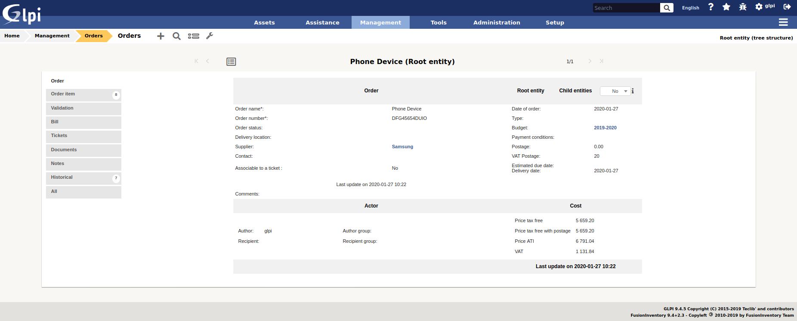

Once the reference catalogue has been created, it is now possible to add material orders.
The fields to be filled in are :

* Sub-entities: indicates if the order is visible in the sub-entities
* Order name
* Order number (required)
* Date of order (required)
* Budget: The budget to which the purchase order is posted.
* Vendor purchase order number: Indicates the internal number for the purchase order at the vendor.
* Payment terms: free field (can contain for example 30 days end of month, 60 days end of month, etc)
* Billing number
* Supplier: the supplier with whom the order is placed. Only the catalogue references from this supplier may be added to the order.
* Place of delivery of the order: indicates the place where the equipment will be delivered. This option has value only in the entity in which the order is created.
* Description: description of the order
* Status: Indicates the current status of the purchase order in the release run.
* Estimated delivery date: indicates the indicative date by which the supplier must deliver the order.

It is also possible to :

* Define author and recipient

Adding articles
^^^^^^^^^^^^^^^

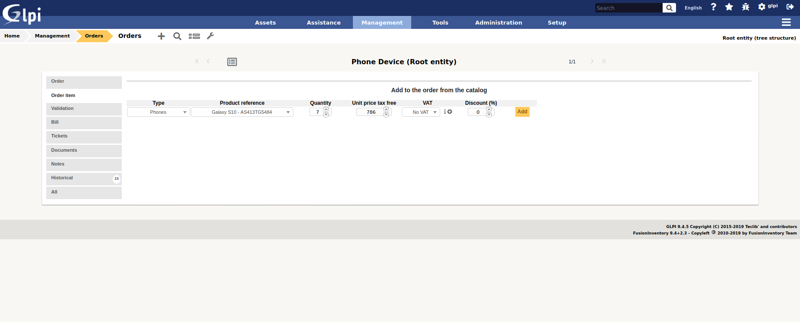

In the Details tab, it is now possible to add products to the order.

* Select the type of material to add to the order
* Select product number
* Indicate the quantity to order
* Change the unit price if it is not the price indicated in the product reference.
* Indicate the percentage discount on products
* You can then validate the addition of these products to the order.

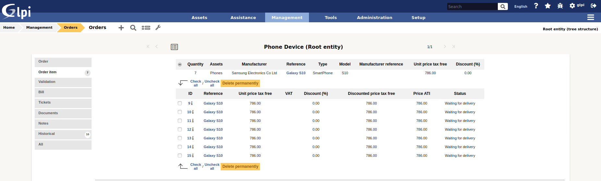

Note: it is possible to modify the price and the discount of a set of materials when the order is being edited.
To do this, simply double-click on one of these 2 fields, modify its value and then validate the change.

Validation workflow
^^^^^^^^^^^^^^^^^^^

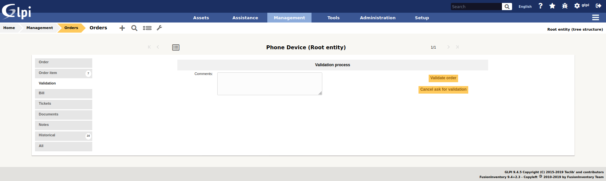

The plugin has a validation workflow that works as follows:

* Creating the order: status In progress
* Request for order release: status Pending approval
* Order confirmed: the order then goes to the status In process of delivery.
* Order completely received: automatic switch to Delivered status
* Cancelled purchase order: Change to status Cancelled

The definition of the persons having the right to make a validation request,
to validate or to cancel an order is done in the edition of the profiles.

Receiving the order
^^^^^^^^^^^^^^^^^^^

Once the order has been confirmed, the equipment can begin to be received.
To do this, you must go to the Receiving Equipment(s) tab.
Each product is identified by a line with the following information:

* Product reference
* Number of equipment(s) received
* Number of material(s) related to inventory items in GLPI
* Unit price of the product (excl. VAT)
* Unit price of the product (incl. VAT)
* Price per unit awarded (excl. VAT)

By clicking on the *+* icon on the left of the line, it is possible to access the details of the products ordered.

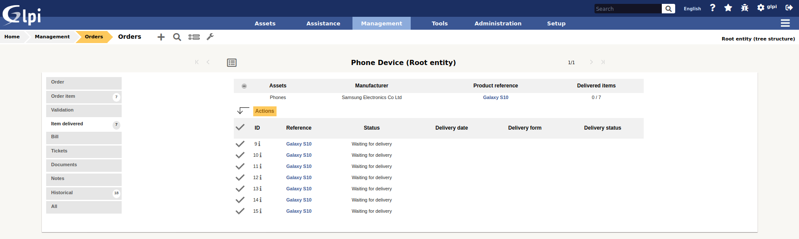

Receiving material
^^^^^^^^^^^^^^^^^^

It is possible to receive the material that has been ordered, from the moment the order is validated.
You have to go to the tab Reception of material(s).
One line is displayed for each product reference ordered. This line contains the following information:

* Product reference
* Received equipment(s): indicates the number of equipment received out of the total number of equipment ordered for this product.
* Related equipment(s): number of goods received related to inventory items in GLPI
* Price per unit (excl. VAT)
* Unit price (incl. VAT)
* Price per unit awarded (excl. VAT)

In order to proceed to the reception of products, just click on the + icon on the left of the line.

There are 2 ways to receive material :

* Reception of materials selected from the list of products ordered but not yet received
* Receipt of materials in bulk: in this case we will indicate how many products are received (without first selecting from the list).

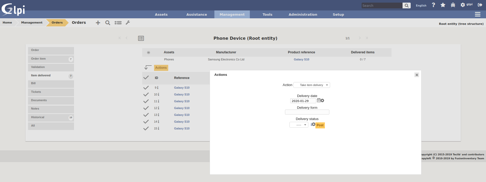

In both cases, it is necessary to return the delivery note associated with the reception of the material. Alternatively, a status of the received objects can be indicated (e.g. Conforming, Non-conforming, etc).
Once received, it is possible to :

* Generate a material in GLPI from the received product
* Link the product received to existing GLPI equipment

Generate the material
^^^^^^^^^^^^^^^^^^^^^

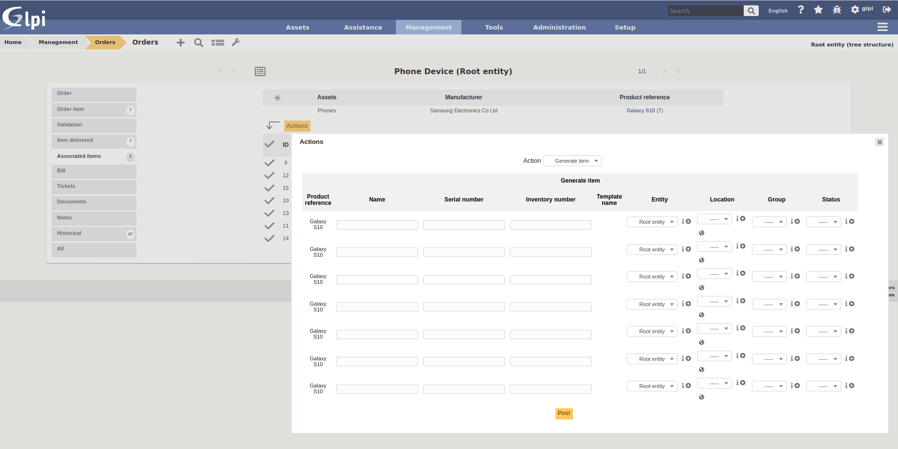

In order to generate materials from received products, simply select from the list those for which this operation is to be performed.
Then select the Generate associated material option.
A screen will appear. Each line represents a received product, and the following information must be given:

* Name of the material generated in GLPI
* Serial code
* Asset number

Note:

* If there is a template associated with the reference of the generated product, and if the latter is created in the same entity as the reference, then the inventory object in GLPI will be created from this template.
* The financial information of the order will be carried in the newly created inventory object.

Link to an inventory item
^^^^^^^^^^^^^^^^^^^^^^^^^

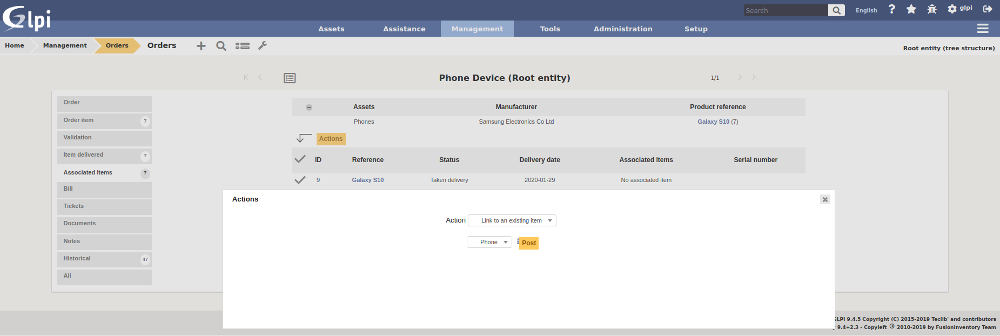

It is possible not to generate a received product, but to link it to material already present in GLPI.
To do this, you must select the option Link to an existing material.
A drop-down list will appear and will present all the materials present in GLPI which :

* Are in the entity of the order (or in a sub-entity if the order is visible in the sub-entities)
* With the same type of equipment
* With the same type of equipment
* Identical

Once linked to a product, the material in GLPI will receive the financial information from the order.

Rights management
-----------------

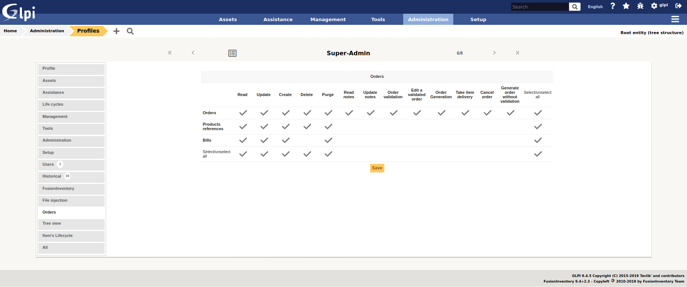

The plugin rights management allows to define, by profile, if the user has the right to :

* Manage commands
* Manage product references
* Manage invoices
* Confirm an order
* Cancel an order
* Modify a validated order

FAQ
---

If you have any questions about using the plugin, please consult `our faq <https://faq.teclib.com/04_Plugins/Order/>`__