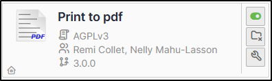
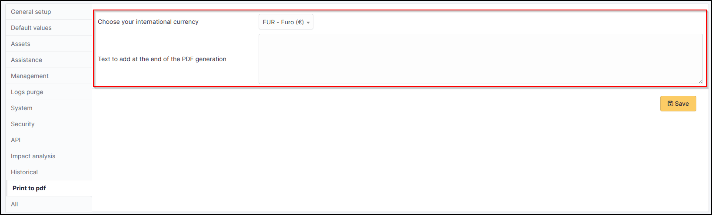
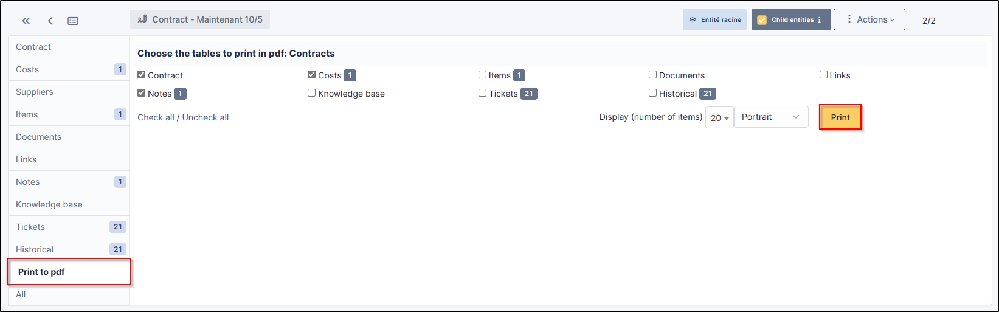
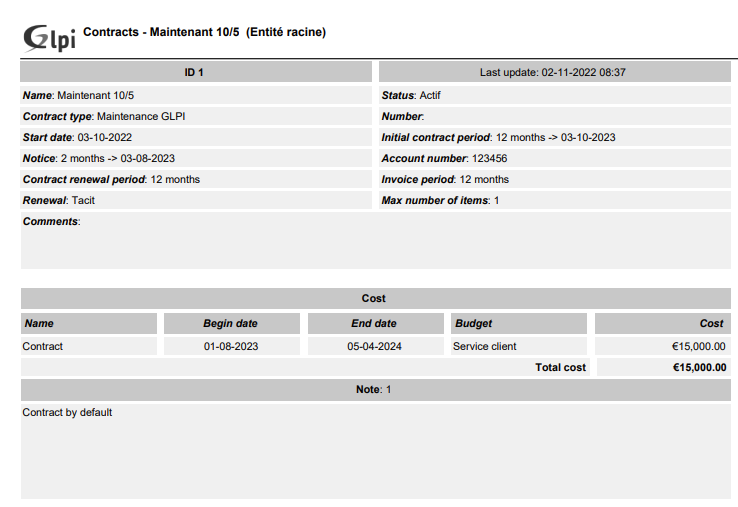

PDF
===

Requirements (on-premise)
-------------------------

============ =========== ===========
GLPI Version Minimum PHP Recommanded
============ =========== ===========
10.0.x       8.1         8.2
============ =========== ===========

.. note::
   This plugin is available without a GLPI-Network subscription. It is also available in Cloud.

Install the plugin
------------------

-  Go to the marketplace. Download and install the plugin **PDF**

Set up the plugin
-----------------

-  From **setup > general > print to pdf**, select :

   -  your preferred currency
   -  Any text that will be displayed on the PDF.

Using the plugin
----------------

.. note::
   Printing a contract and its related elements

-  From **Management > Contracts**, select the contract you require
-  From the **print pdf** tab
-  Click on **print**

