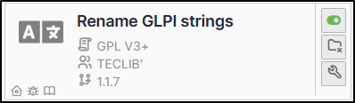
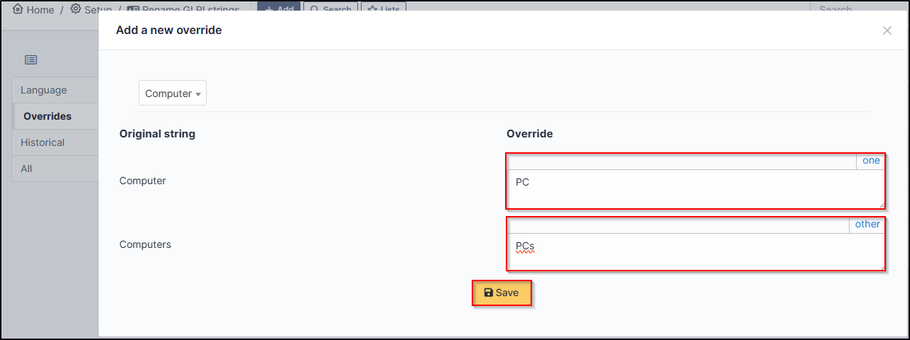

Rename GLPI strings
===================

Requirements (on-premise)
-------------------------

============ =========== ===========
GLPI Version Minimum PHP Recommended
============ =========== ===========
10.0.x       8.1         8.2
============ =========== ===========

.. Note::
   A `basic licence <https://services.glpi-network.com/#offers>`__ (or higher) is required. This plugin is also available from the `Cloud <https://glpi-network.cloud/fr/>`__

Download the plugin
-------------------

-  Go to **marketplace**. Download and install the plugin **Rename GLPI strings**

Creating an override
--------------------

-  Go to **Setup > Rename GLPI strings**
-  Click on **Add** and select the appropriate language.
-  In the **Override** tab, click on **New override**.
-  Select the value you wish to change from the drop-down list. You can search directly.

We are going to change the value **computer** to **PC**

- Select computer and enter the singular and plural of the word to be changed in the corresponding fields.
-  Click on **Save**

Show the change
---------------

You may not see the change immediately. To make it appear, disconnect/reconnect.

Before :

After :

.. figure:: images/Rename_strings-4.png
   :alt:
