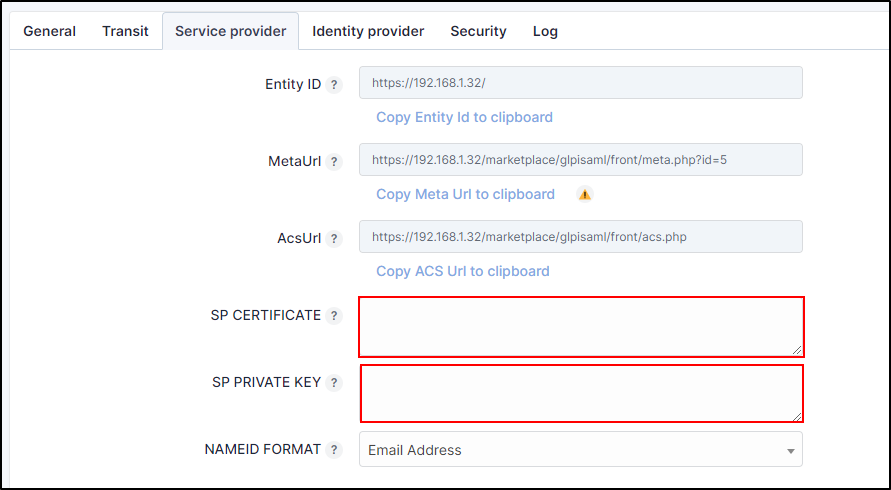
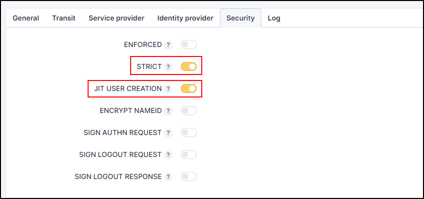

Entra
=====

.. include:: tabs/add-app.rst

.. include:: tabs/for-entra.rst

Add an app in Entra
-------------------

* Connect to your `Entra portal <https://portal.azure.com/#home>`_
* Click on **Entreprise Application**
* **And + New application**
* In the search bar, enter **saml toolkit**
* Click on **Microsoft Entra SAML Toolkit**

* Optionnal : You can rename this app
* Click on **Create**

When the application is created :

* Go to **Single sign-on**
* Click on SAML

.. image:: images/setup-saml-entra.png
    :alt: create SAM app entra
    :scale: 51%

Setup the app
-------------

* In the 1st insert, click on **Edit**
* Copy the values as follows

.. image:: images/setup-basic-saml-entra.png
    :alt: Report the values in entra
    :scale: 90%

.. image:: images/setup-basic-saml-glpi.png
    :alt: See the values in GLPI
    :scale: 75%

Setup the Service Provider
---------------------------

In **SP certificate** and **SP Private Key**, copy/paste your certificate in place of those already present.
There are no strict requirements for these certificates, other than that they are valid X509 certificates.

Setup the Identity Provider
---------------------------

* In the third insert of Entra app, click on **Download** from **Certificate (Base64)**

.. image:: images/extract-certificate.png
    :alt: Download certificate
    :scale: 90%

* **Open** this certificate with notepad ++ (or other tool which can read this type of certificate)
* **Copy** the content of the certificate in GLPI with the tags
* **Paste** the certificate in **Identity provider** > **X509 certificate**
* Then fill in the fields as follows withe the informations in the fourth insert :

.. tip:: It is advisable to use **none** as the **REQ AUTHN CONTEXT**

Security
--------

For a production instance, you must activate the **Strict** option.

We advise you to activate **JIT user creation**. This will allow the rules you create from JIT Rules to be applied.

.. Warning::
    For the plugin to authenticate a user, the field must contain a **valid UPN** formatted **as an email**.
    This behaviour can lead to duplicate entries in GLPI when users leave Ldap.
    This is an important detail because some users who leave Active directory in certain scenarios still use the usersam account name
    (old netbui names) as the UPN in entra.
    As a result, the nameId field in the samlResponse will not be populated with a valid email address.
    The username field is used because the email field is not guaranteed to be unique in GLPI and it is essential that a
    unique identifier is used to allow authorisation of a specific GLPI user.

Add users allowed to use SAML
-----------------------------

SAML needs users/groups to be added so that they are authorised to use authentication.

* Click on **users and groups** tab,
* Click on **+ Add user/group**
* Select all the users and groups required
* Click on **Assign**

Mapping
-------

If you wish to add additional information to your profile, you can use Attributes & Claims.
Your profile will be populated with the information entered in Entra.

* In **Single sign on**, click on **Edit**
* Copy the URL of the one of the other claim

* Click on **+ Add new claim**
* Select a name
* Paste the URL you've just copied ine **Namespace**
* Selct **attribute**
* Search the value that you want in the **Source attribute**
* Save your modification
* Repeat this step for all the desired values

.. image:: images/add_claims_entra.png
    :alt: add claims in Entra
    :scale: 45%

.. include:: tabs/rules.rst

.. include:: tabs/source.rst