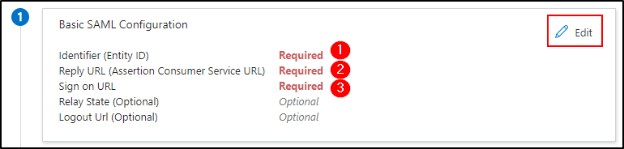

Entra
=====

.. include:: tabs/add-app.rst

Add an app in Entra
-------------------

* Connect to your `Entra portal <https://portal.azure.com/#home>`_
* click on **Entreprise Application**
* **And + New application**
* In the search bar, enter **saml toolkit**
* Click on **Microsoft Entra SAML Toolkit**

.. image:: images/add-app-entra.png
    :alt: create app entra
    :scale: 72%

* Optionnal : You can rename this app
* Click on **Create**

When the application is created :

* Go to **Single sign-on**
* Click on SAML

Setup the app
-------------

* In the 1st insert, click on **Edit**
* Copy the values as follows

Setup the Identity Provider
---------------------------

* In the third insert of Entra app, click on **Download** from **Certificate (Base64)**

* **Open** this certificate with notepad ++ (or other tool which can read this type of certificate)
* **Copy** the content of the certificate in GLPI with the tags
* **Paste** the certificate in **Identity provider** > **X509 certificate**
* Then fill in the fields as follows withe the informations in the fourth insert :

.. image:: images/setup-identity-provider.png
    :alt: Paste certificate and setup the values
    :scale: 42%

.. image:: images/setup-identity-provider-toolkit.png
    :alt: setup the values
    :scale: 100%

Add users allowed to use SAML
-----------------------------

SAML needs users/groups to be added so that they are authorised to use authentication.

* Click on **users and groups** tab,

* Click on **+ Add user/group**
* Select all the users and groups required
* Click on **Assign**

.. include:: tabs/rules.rst

.. include:: tabs/source.rst