Google
======

.. include:: tabs/add-app.rst

Add an app in Google
--------------------

* Connect to your `Google portal <https://accounts.google.com/>`_
* Click on **Apps**
* Cick on **Web and mobile apps**
* Then, click on **Add app**
* And **Add custom SAML app**

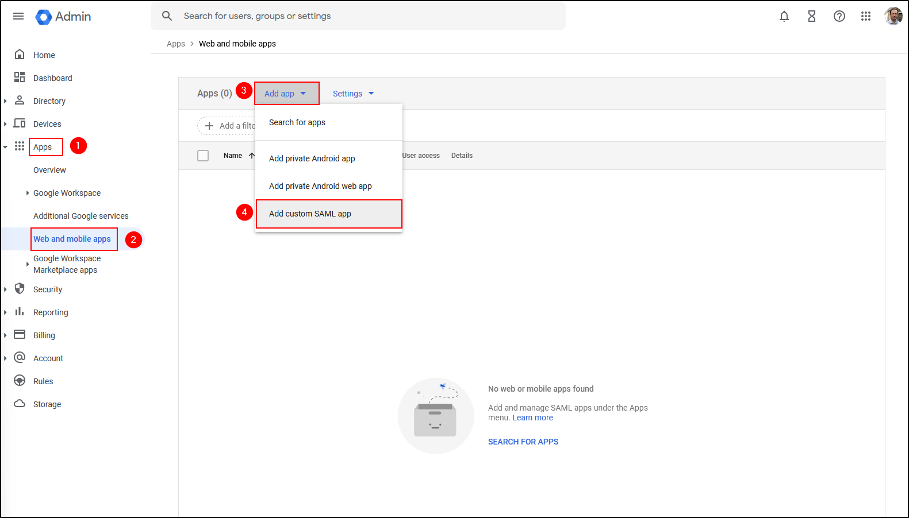

* Name your application
* Click on **Continue**

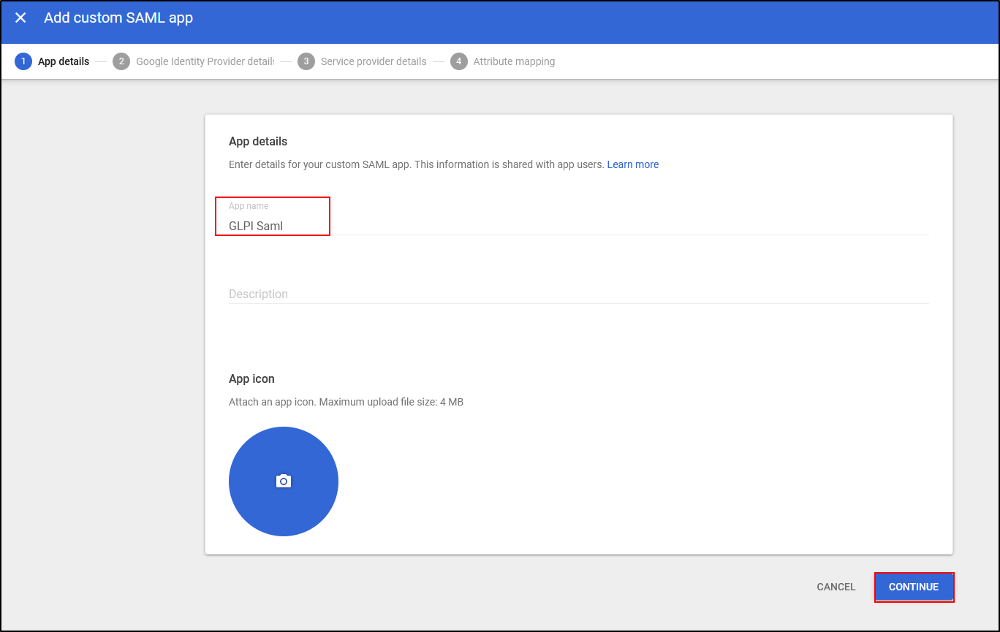

- Click on **Save** on GLPI.

Setup the Identity Provider
---------------------------

* Enter the values as shown in the 2 screenshots below

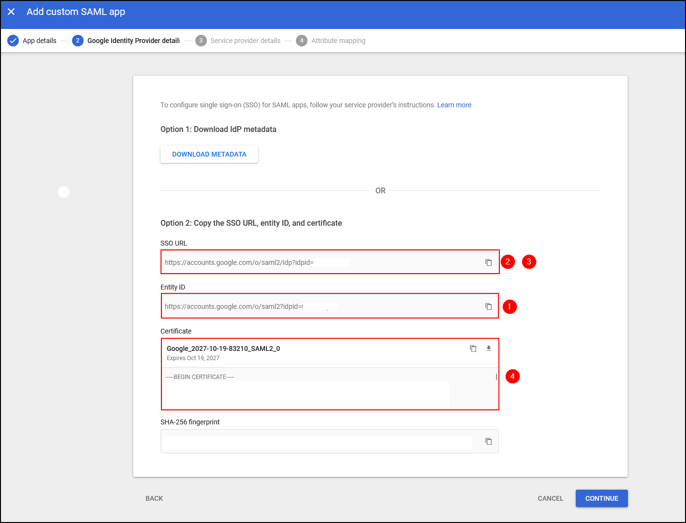

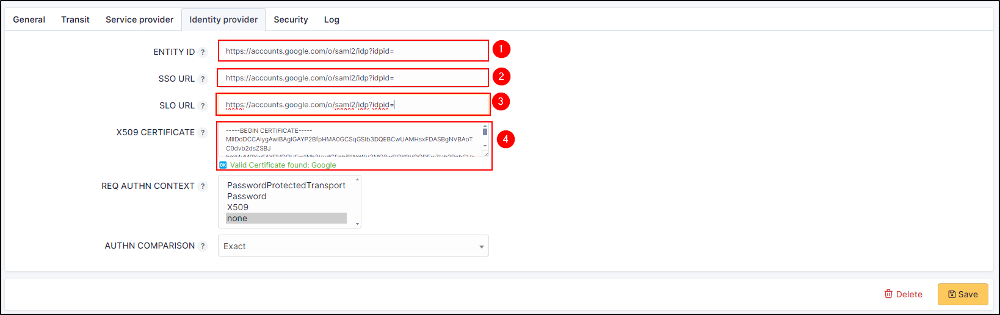

.. tip:: Copy/paste the content of the certificate in GLPI with the tags *---BEGIN CERTIFICATE--- ---END CERTIFICATE---*

Setup the Service Provider
---------------------------

* In Service provider details, report the values from GLPI to Google :

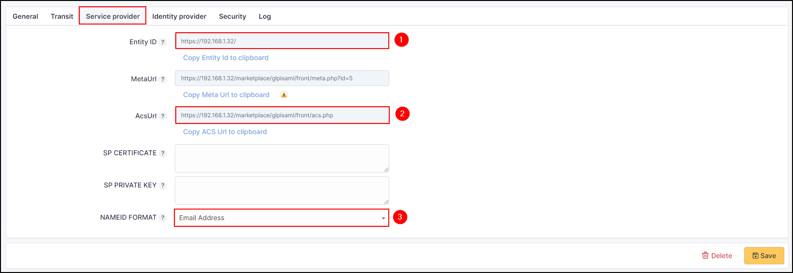

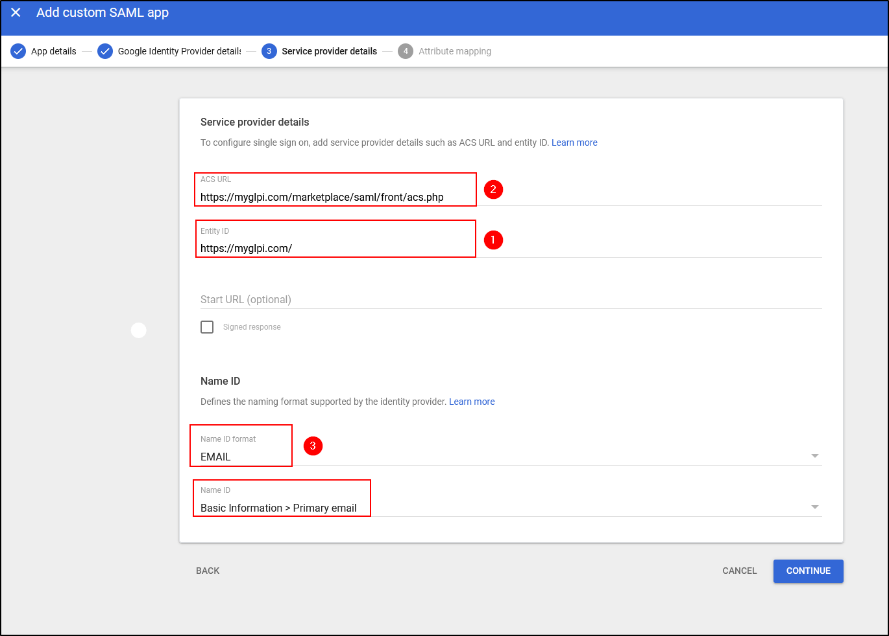

* From Google, select **EMAIL** in **Name ID format**
* In **Name ID**, select **Basic information > Primary email**
* From GLPI, select **Email Address** in **NAMEID FORMAT**

In **SP certificate** and **SP Private Key**, copy/paste your certificate in place of those already present.
There are no strict requirements for these certificates, other than that they are valid X509 certificates.

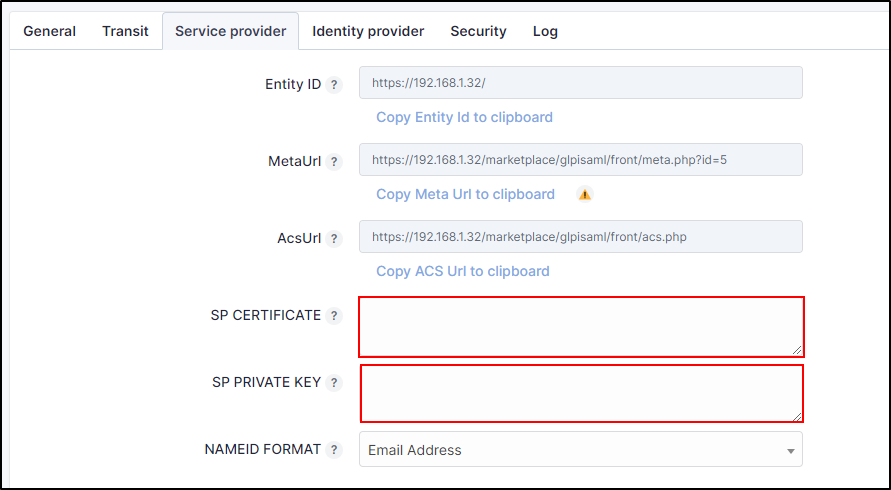

* Click on **Continue**
* Then **Finish**

Your app is now created

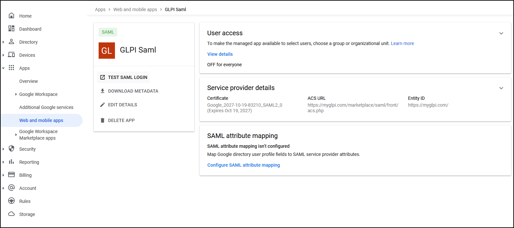

Add users allowed to use SAML
-----------------------------

SAML needs users/groups to be added so that they are authorised to use authentication.

* On your appl, click on **Viex details** tab in **User access**
* Click on **On for everyone**
* Click on **Save**

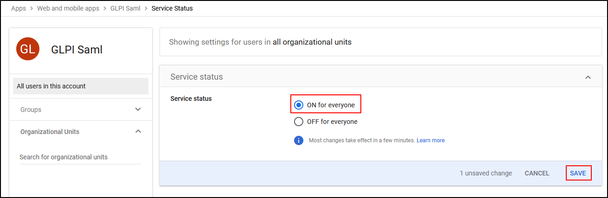

Mapping
-------

If you wish to add additional information to your profile, you can use Attributes.
Your profile will be populated with the information entered in Entra.

* In you app, click on **Configure SAML attribute mapping** in **SAML attribute mapping**
* Copy the URL of the one of the other claim
* Add informations that you want
* Click on **Save**

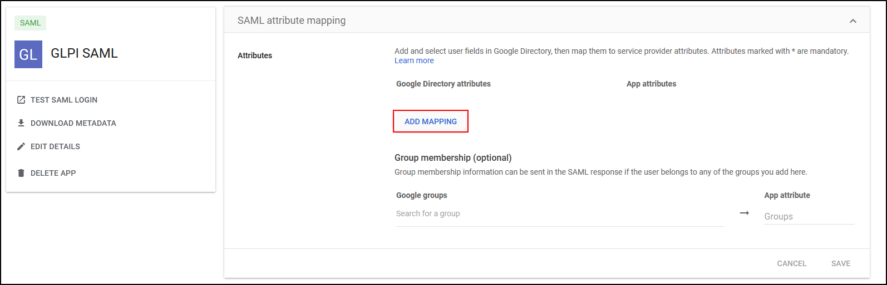

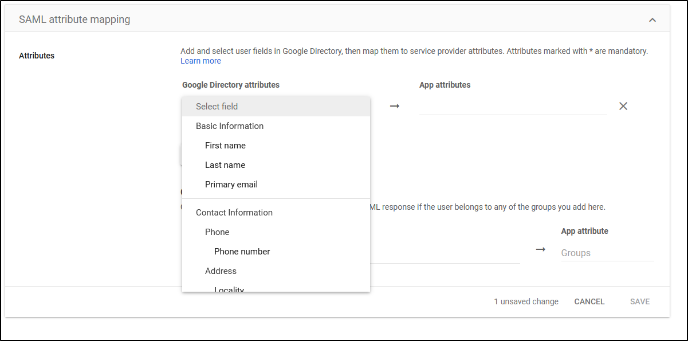

.. include:: tabs/rules.rst

.. include:: tabs/source.rst