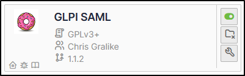

Requirements (on-premise)
-------------------------

============ =========== ===========
GLPI Version Minimum PHP Recommended
============ =========== ===========
10.0.x       8.1         8.2
============ =========== ===========

.. include:: ../include/no_subscription.rst

.. note::
   **We recommend using the** :doc:`OAuth SSO </oauthsso/index>` **and** :doc:`SCIM </scim/index>` **plugins if you need autologin or user provisioning, officially supported by the publisher.**

   But we suggest using this plugin if SAML protocol is mandatory for your organization.

.. Warning::
   You need an admin access to the Entra/Google console to setup the application

Download the plugin
-------------------

-  From the marketplace (**Setup > Plugins**), download the **GLPI SAML** plugin

