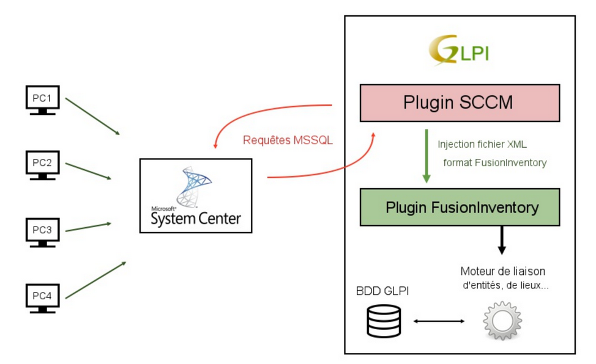

SCCM
====

Sources
-------

* Sources link: https://github.com/pluginsGLPI/sccm
* Download: https://github.com/pluginsGLPI/news/sccm

Requirements for latest version
-------------------------------

This plugin requires :

* PHP 7.2 or higher
* GLPI >= 9.4
* FusionInventory plugin for GLPI
* SCCM >= 1802
* PHP curl_init and sqlsrv_connect
* Microsoft System Center Configuration Manager
* Microsoft Drivers for PHP for Microsoft SQL Server

.. Note::
   This plugin is available without a GLPI-Network subscription. It is not available in `Cloud <https://glpi-network.cloud/>`__

Features
--------

Plugin to synchronize computers from SCCM (version 1802) to GLPI (version 9.3 and 9.4).
It uses the "FusionInventory for GLPI" plugin and the power of its internal engine.

Workflow
--------

* This plugin add two automatic actions : "SCCMCollect" et "SCCMPush"
* The automatic action "SCCMCollect" queries the SCCM server with MsSQL queries.
* This same action builds an XML foreach computer (in FusionInventory format).
* The automatic action "SCCMPush" injects XML files into GLPI over HTTP(s) (via cURL and FusionInventory) to display computer in GLPI.

Schematic diagram
-----------------

Collected data
--------------

Depending on data availability in the SCCM server, foreach computer we collect:

* Computer: name, last connected user, UUID, user login, domain, comments, serial
* Operating system: name, architecture, version, service pack
* BIOS information: tag, model, type, manufacturer, serial, install date, version
* CPU: description (or name), manufacturer, frequency, type (arch), nb core, nb threads
* Softwares: name, version, editor, install date
* Memory (RAM): capacity, decription, frequency, type, bus, serial
* Graphical card: name, chipset, memory
* Sound card: name, manufacturer
* Network card: name, MAC address, IP address (v4, v6)
* Disk part: name, mount type, total size

Automatic actions
-----------------

SCCMCollect
^^^^^^^^^^^

Action to collect data from SCCM to XML files.

SCCMPush
^^^^^^^^

Action to push XML file to FusionInventory plugin