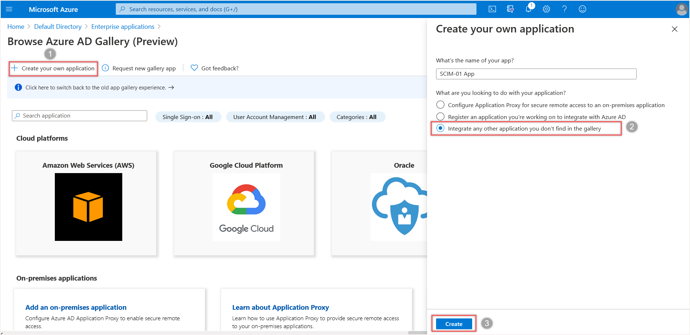

:orphan:

Azure portal
============

References:
-----------

-  `Use scim to provision users and groups <https://learn.microsoft.com/fr-fr/azure/active-directory/app-provisioning/use-scim-to-provision-users-and-groups#integrate-your-scim-endpoint-with-the-azure-ad-provisioning-service>`__

Setup
-----

-  Connect to your `Azure portal <https://aad.portal.azure.com/>`__ and  go to the **Azure Active Directory** > **Enterprise applications** menu.
-  Select **New application** and choose **Create your own application**.
-  Choose a name for your application, select **Integrate any other application you don’t find in the gallery (Non-gallery)** and click on the **[Create]** button.

-  In the “Provisioning” section,

   -  Select **Automatic**,
   -  Fill **Tenant Url** with the API url of your SCIM server you copied from the :ref:`plugin configuration <setup_scim>`.
   -  Optionally, fill **Secret** field:
      For Azure, the awaited secret is a long life valid jwt token.
      We cannot use an oauth exchange (Azure doesn’t ask for an authorize URL).
      So in GLPI, setup you SCIM server with **Bearer** security and paste the JWT token from GLPI in the **Secret token** field of Azure.
   -  Click on the **Test connection** button to validate your parameters.
   -  If the test succeed, click on the **[Save]** button.

   .. figure:: pics/azure-2.png
      :alt: Azure Configuration provisioning
      :scale: 100 %

   -  You must choose in the **Parameters** > **Extended** section how you want to synchronize your users and groups:

      -  Only users and groups assigned to the application. In this case, you must manually assign your users and groups to the application in the **Users and groups** section.
      -  All users and groups in the directory

   -  After checking the mapping section, enable the **Provisioning** at the bottom and click on the **[Save]** button.
   -  You can check the advancement in the **Provisioning logs** section.
      Usually it start after a few minutes.
