Entra
-----

References:
~~~~~~~~~~

-  `Use SCIM to provision users and groups <https://learn.microsoft.com/en-us/entra/identity/app-provisioning/use-scim-to-provision-users-and-groups#integrate-your-scim-endpoint-with-the-azure-ad-provisioning-service>`_

Setup
~~~~~

Create application
~~~~~~~~~~~~~~~~~~

- Connect to your `Azure portal <https://aad.portal.azure.com/>`_
- Click on **Add**
- then **Enterprise application**.

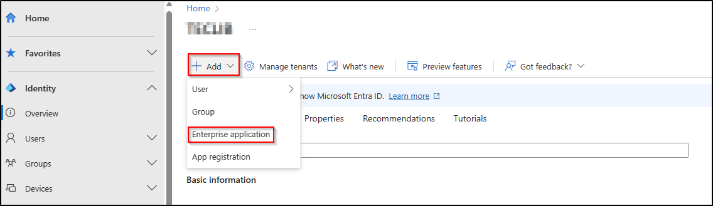

- Click on **Create your application**.
- In the section that appears on the right, enter the name of your application and choose the 3rd option **`integrate any other application don't find in the gallery`**.

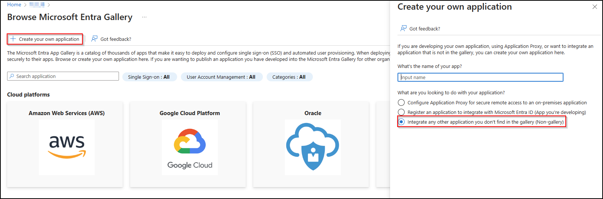

Setup the application
~~~~~~~~~~~~~~~~~~~~~

- Once you've created your application, go to **Provisioning**.

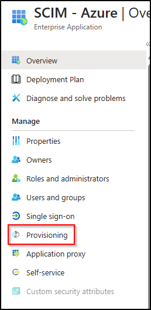

- Select **Automatic**.
- Specify the **URL** `generated earlier <setup_plugin.html>`_ from GLPI and paste the **token**.

.. Warning:: Make sure you **paste the token (JWT token)** to ensure your application works properly.

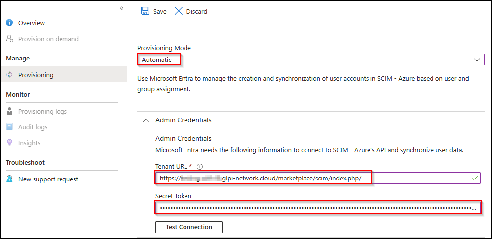

- Click on Test connection. A message will appear informing you of the successful connection.

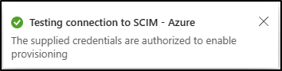

- On the same page, you can also configure an email address and a number in case of failure or accidental deletions.

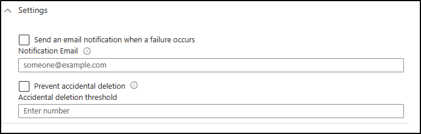

- Click on **save**

Synchronising all users
~~~~~~~~~~~~~~~~~~~~~~~

- You can choose to synchronise your entire directory.
- Go to the **settings > scope** tab and select **sync all users and groups**.

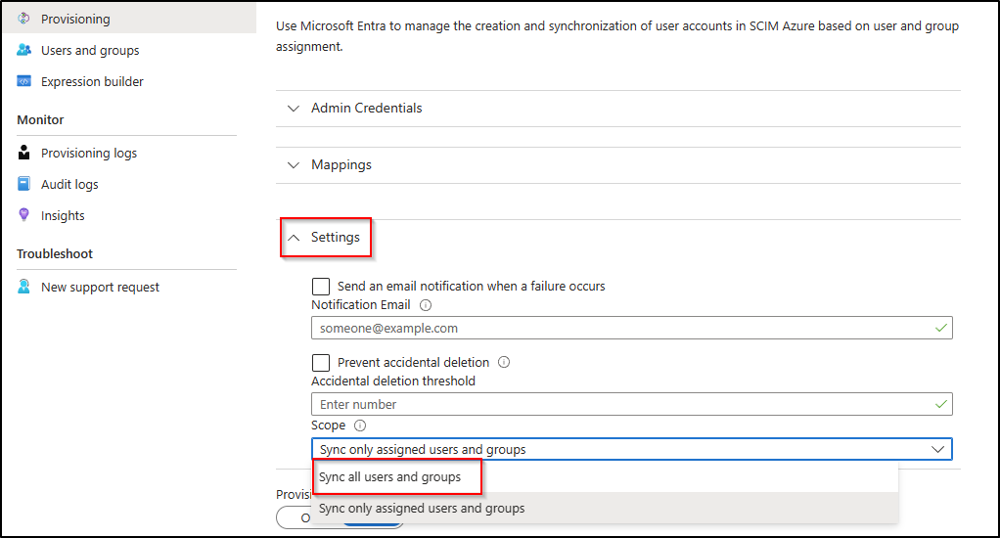

Synchronising selected groups and users (default option)
~~~~~~~~~~~~~~~~~~~~~~~~~~~~~~~~~~~~~~~~~~~~~~~~~~~~~~~~

- You can choose to synchronise only certain groups and/or users. When refreshing the **`provisionning`** page
- Go to the **parameters > scope** tab
- Select **synchronise assigned users and groups only**

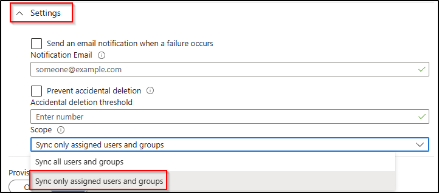

- Then go to **Users and groups**
- Click on **add a user/group**
- Click on **no selection**
- Select the groups and users you want in the box on the right
- Then **select** and **assign**.

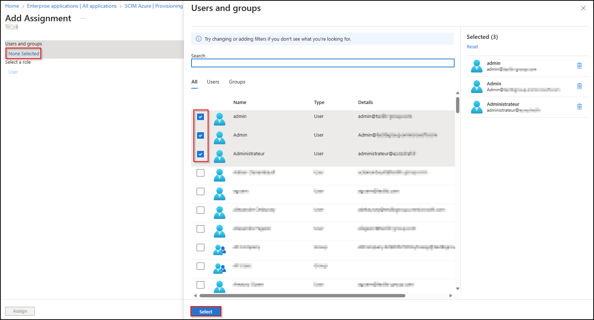

Activate provisioning
~~~~~~~~~~~~~~~~~~~~~

- In the **provisionning** section
- Change the status from **disabled** to **enabled**

Check synchronisation status
~~~~~~~~~~~~~~~~~~~~~~~~~~~~

- In the **overview** section, you can check that synchronisation has been successful.

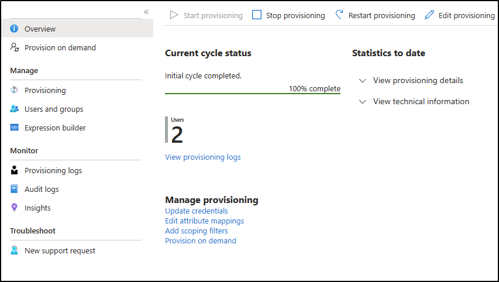

- On the GLPI side, Go to the **request log** section of your SCIM plugin **configuration** > **SCIM identity servers** to check that the accounts are correctly synchronised.

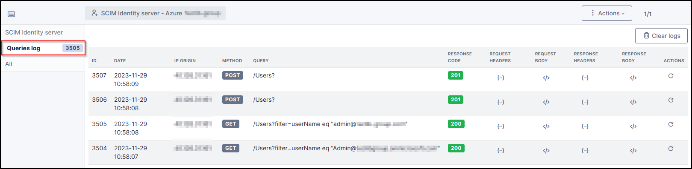

.. Important::
   See the procedure for setting up the `OAuth SSO <https://glpi-plugins.readthedocs.io/en/latest/oauthsso/entra.html>`_ plugin to authenticate users on GLPI  to authenticate your user.