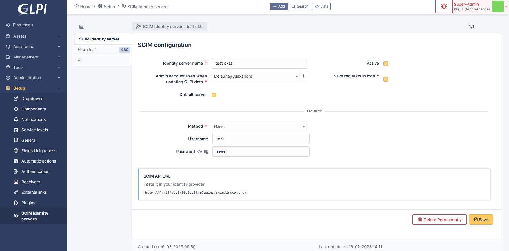
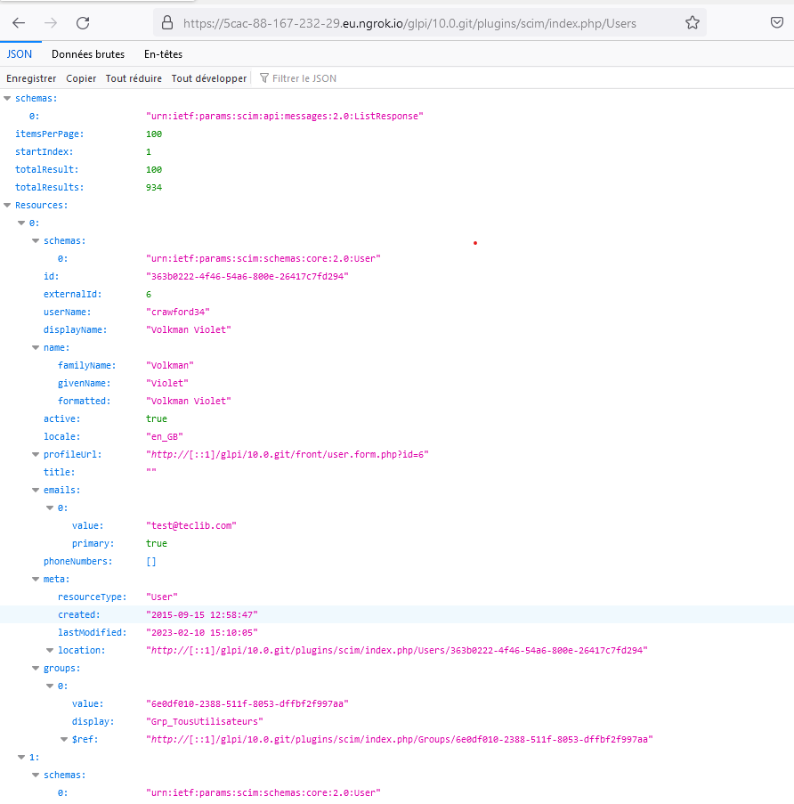

SCIM
====

Requirements (on-premise)
-------------------------

============ =========== ===========
GLPI Version Minimum PHP Recommended
============ =========== ===========
10.0.x       8.1         8.2
============ =========== ===========

.. note::
   A `basic licence <https://services.glpi-network.com/#offers>`__ (or higher) is required. This plugin is also available from the `Cloud <https://glpi-network.cloud/fr/>`__.

.. figure:: pics/logo.png
   :align: Center
   :scale: 70 %

This plugin let you provision your users and groups from an external identity provider using the `SCIM <https://en.wikipedia.org/wiki/System_for_Cross-domain_Identity_Management>`__ protocol. The update from the directory to GLPI is done “just in time”.
Each modification is done on the fly, without any cron. GLPI is the service provider, and the directory is the identity provider.

**Warning, the SCIM API endpoint provided by the plugin must be accessible from the identity provider.** If we talk about Azure or Okta, this particular url should be available from the internet. We suggest strongly to limit the ip addresses that can access this url (in addition of adding a strong authentication method).

.. _setup_scim:

Setup
-----

You must declare an identity server in the plugin configuration (You can add any number).
Go to **Setup** > **SCIM Identity servers** menu and click the **[+ Add]** button on top of the page.

Fill at least:

- The name of the server,
- the user applied on GLPI when receiving a request (this will identify the user in th GLPI logs),
- check the “Active” field,
- and submit by clicking the [+ Add] button at the bottom of the form.

You’ll be given an API url you may paste into your identity provider configuration. Check `specific provider documentation <#providers>`__ for more details.

You may set some optional parameters :

-  **Save requests in logs**: if checked, all requests will be saved in the “Historical” tab of your declared server.
-  **Default server**: if checked, this server will be used by default without providing it’s id in the API Url.
-  **Security**: a dropdown of available security methods. Currently implemented:

   -  **None**: no security, anyone can access the API.
   -  **Basic**: HTTP Basic authentication. You must provide a username and a password.
   -  **Digest**: HTTP Digest authentication. You must provide a username and a password.
   -  **Bearer**: HTTP Bearer authentication. A long lived (10years) jwt token will be generated.
   -  **OAuth2**: OAuth2 authentication. You must provide at least a valid redirection uri. We support the following flows:

      -  Authorization code.
      -  Client credentials.

Your SCIM server is now ready to receive requests from your identity provider.

Providers
---------

- :doc:`Azure <azure>`
- :doc:`Okta <okta>`

A Note about passwords sync
---------------------------

Although it’s mentioned in the `SCIM specifications <https://datatracker.ietf.org/doc/html/rfc7643#section-9.2>`__, password sync is not always available depending on the provider:

-  Azure: `not available <https://learn.microsoft.com/en-us/answers/questions/1113754/azure-ad-scim-provisioning-how-to-sync-passwords>`__
-  Okta: `available <https://developer.okta.com/docs/concepts/scim/#sync-passwords>`__
