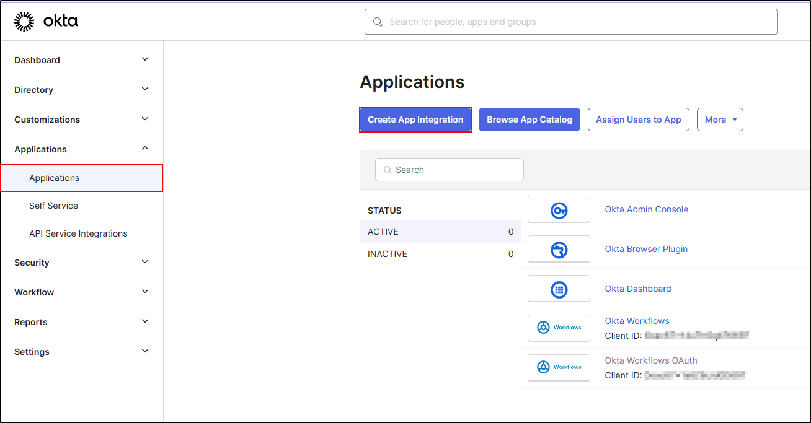
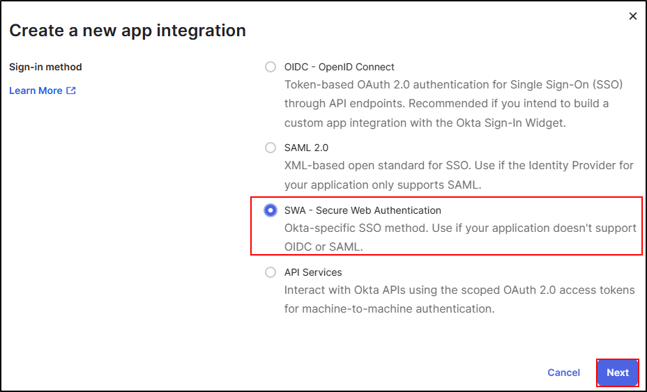
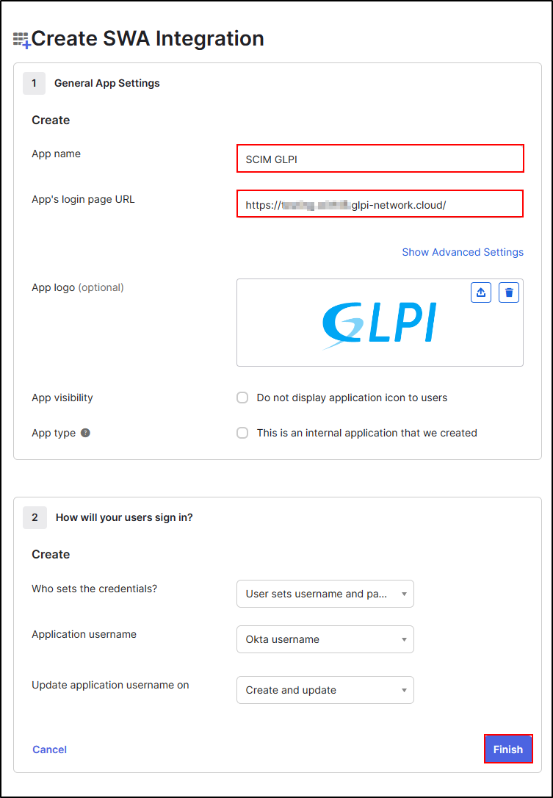
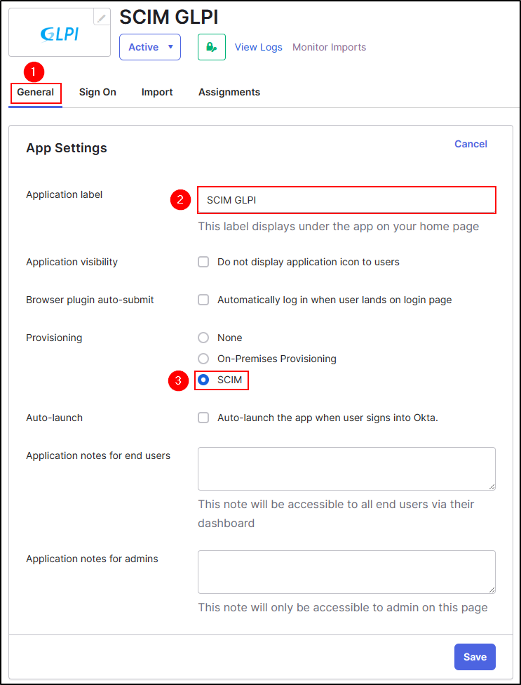
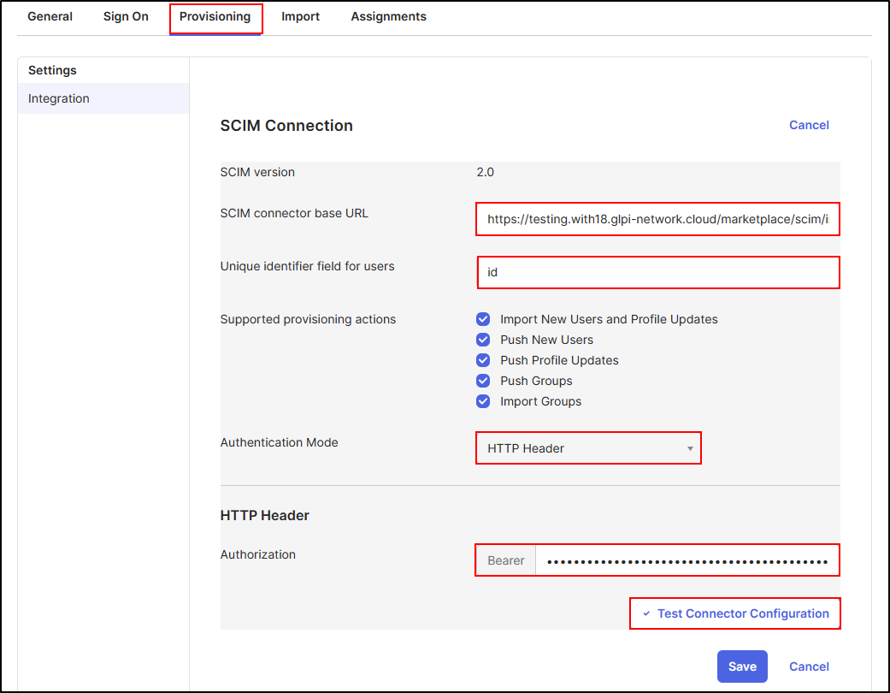
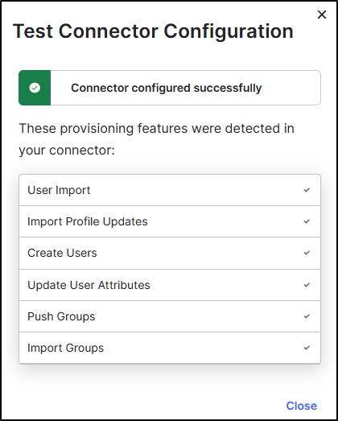
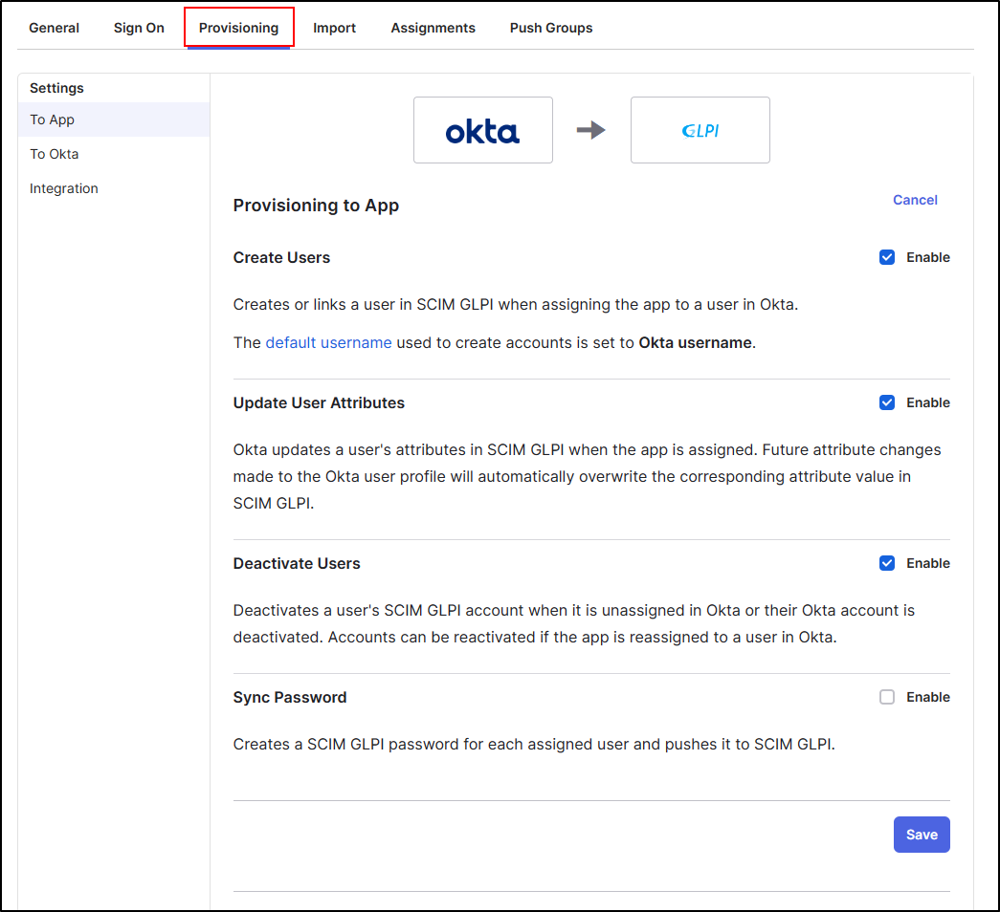
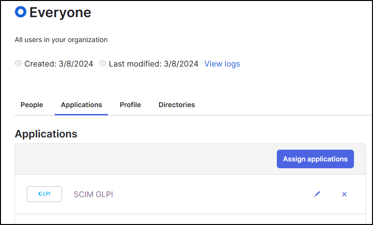

OKTA
----

References
~~~~~~~~~~

-  `Understanding SCIM <https://developer.okta.com/docs/concepts/scim/>`_
-  `Add SCIM provisioning to app integrations <https://help.okta.com/en-us/Content/Toimages/Apps/Apps_App_Integration_Wizard_SCIM.htm>`_
-  `Assign applications to users <https://help.okta.com/en-us/Content/Toimages/users-groups-profiles/usgp-assign-apps.htm>`_

Create application
~~~~~~~~~~~~~~~~~~

- From your `OKTA portal <https://login.okta.com/>`_
- Click on **Applications**
- And **Create app integration**

- Select **SWA - Secure Web Authentication**

- Add a name to your application
- Add the URL of your GLPI instance (this will redirect your user to your GLPI if this application is avaiblable to the OKTA user portal)
- Click **Finish**

Setup the application
~~~~~~~~~~~~~~~~~~~~~

- Go back to **General**
- Click **edit**
- Name the label
- Select SCIM to activate the service
- Click **Save**

To setup the provisionning, you need to setup GLPI. Refer to `setup GLPI <setup_plugin.html>`_ to configure **URL API** and **Jwt Token**

- Copy the **API URL** and the **Jwt token**, you need to paste theses informations in OKTA.

- Go back to your OKTA application
- Paste the API URL
- Select the Unique identifier field for users (*name.familyName, phoneNumber, name.givenName, id, userName, email,* etc. This will be the method to authenticate the users)
- Select the actions which can be supported
- Select **HTTP Header**
- Paste the **Jwt token**

.. Important::
   You need to **paste the Jwt token** not the secret

- Click **Test Connector Configuration**

- you can now **close** this window and **save** your configuration

- Always in **provisionning**, you can edit and select the possible actions for updating your user data.

.. Warning::
   We recommand to unselect **Sync Password** and use `OAuth SSO <https://glpi-plugins.readthedocs.io/en/latest/oauthsso/okta.html>`_ to authenticate your user.

The last step is to assign your application to users

Synchronising all users
~~~~~~~~~~~~~~~~~~~~~~~

- Go to admin console
- Select **Directory > Groups**
- Select **Everyone**
- In **Applications**, click **Assign applications**
- Click on assign on your SCIM application
- Click **Save and Go Back**

Synchronising selected groups and users
~~~~~~~~~~~~~~~~~~~~~~~~~~~~~~~~~~~~~~~

- Go to admin console
- Select **Directory > People**
- Select the **User** you want to import
- In **Applications**, click **Assign applications**
- Click on assign on your SCIM application
- Click **Save and Go Back**

Repeat this step for all users and groups you want to import.

.. Note::
   It seems that OKTA does not offer an automatic way of assigning users to an application if you choose to synchronise groups and selected users.

.. Important::
   See the procedure for setting up the `OAuth SSO <https://glpi-plugins.readthedocs.io/en/latest/oauthsso/okta.html>`_ plugin to authenticate users on GLPI  to authenticate your user.