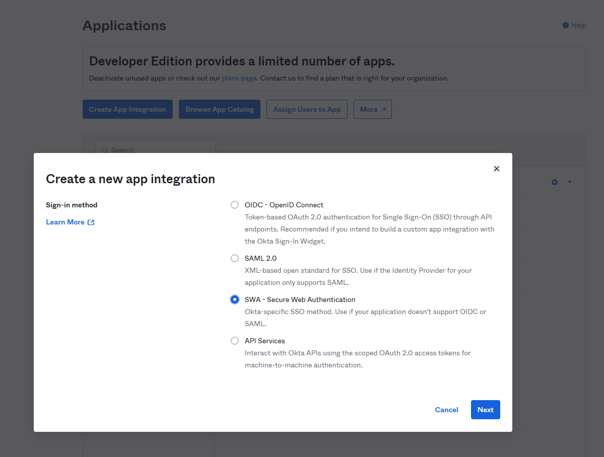
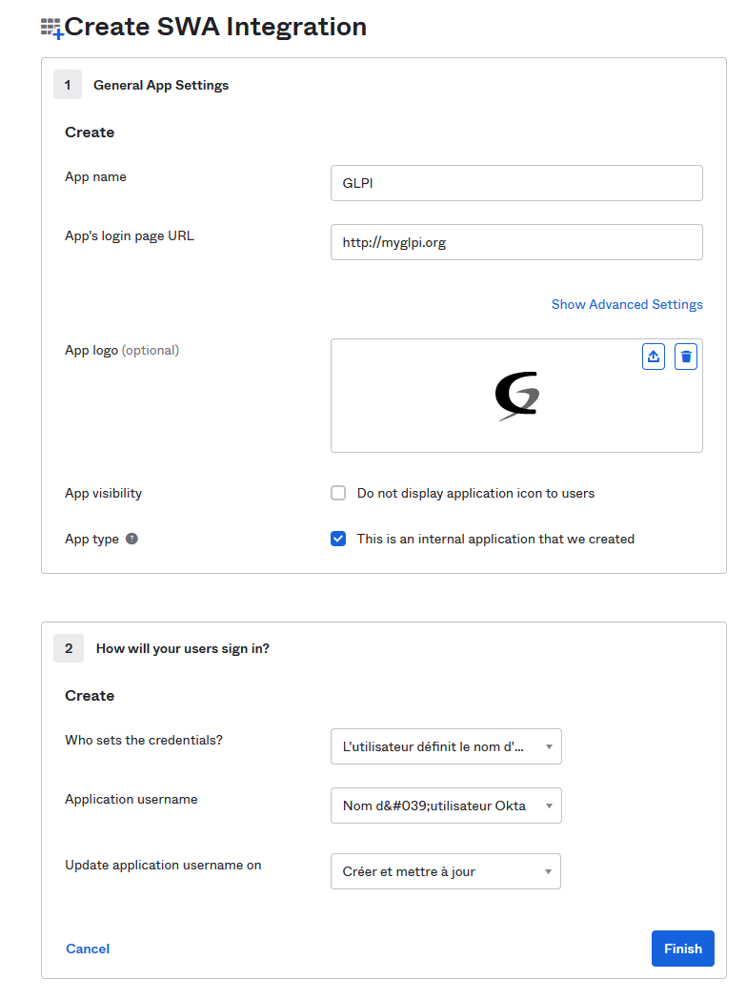
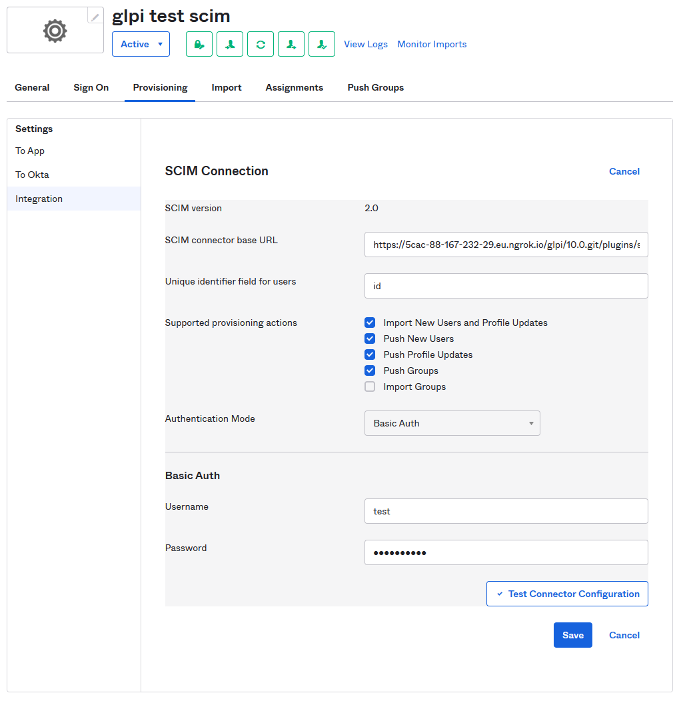

OKTA
====

References:
-----------

-  `Understanding SCIM <https://developer.okta.com/docs/concepts/scim/>`__
-  `Add SCIM provisioning to app integrations <https://help.okta.com/en-us/Content/Topics/Apps/Apps_App_Integration_Wizard_SCIM.htm>`__
-  `Assign applications to users <https://help.okta.com/en-us/Content/Topics/users-groups-profiles/usgp-assign-apps.htm>`__

Setup
-----

After configuring the SCIM plugin, you can declare it in your Okta **Admin console**.
Go to the **Applications** > **Applications** menu and click on the “Create App Integration” button.
Choose **SWA - Secure Web Authentication** and click on the “Next” button.

Fill the form with the following values (you may adapt depending on your context):

-  **App name**: GLPI
-  **App’s login page URL**: the index page of your glpi
-  **App logo**: provide a logo picture
-  **App type**: check “This is an internal app that we have created”

Let the other fields as default and click on the “Finish” button.

After the application has been created, you’ll be redirected to the **General Settings** tab.
You must edit the **App settings** section and check the **Enable SCIM provisioning** before saving your changes.

A new tab named **Provisioning** will appear. Click on it.

Edit the **SCIM Connection** section and fill the following fields:

-  **SCIM connector base URL**: the API url of your SCIM server you copied from the :ref:`plugin configuration <setup_scim>`.
-  **Unique identifier field for users**: ``id``
-  Check all fields in the **Supported provisioning actions** section **EXCEPT “Import Groups” one**
-  Choose the **Authentication mode** you configured in the :ref:`plugin configuration <setup_scim>`.

You can test you configuration and then save your changes.

Final steps, you must assign your application to your users:

1. In the Admin Console, go to **Directory** > **People**.
2. Click a user name in the Person & Username column.
3. Select the Applications tab.
4. Click Assign Applications.
5. Select applications from the list or enter the application name in the Search field.
6. Click [Assign] button.

You’re done, your users will be provisioned in GLPI when they log in.

**NOTE**, it seems OKTA doesn’t give any automatic way to assign users to an application.
