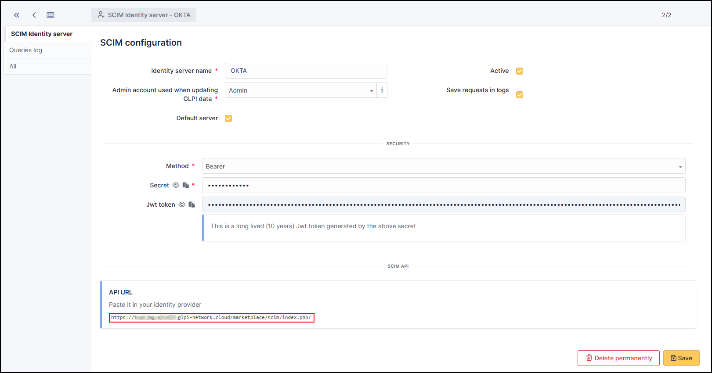
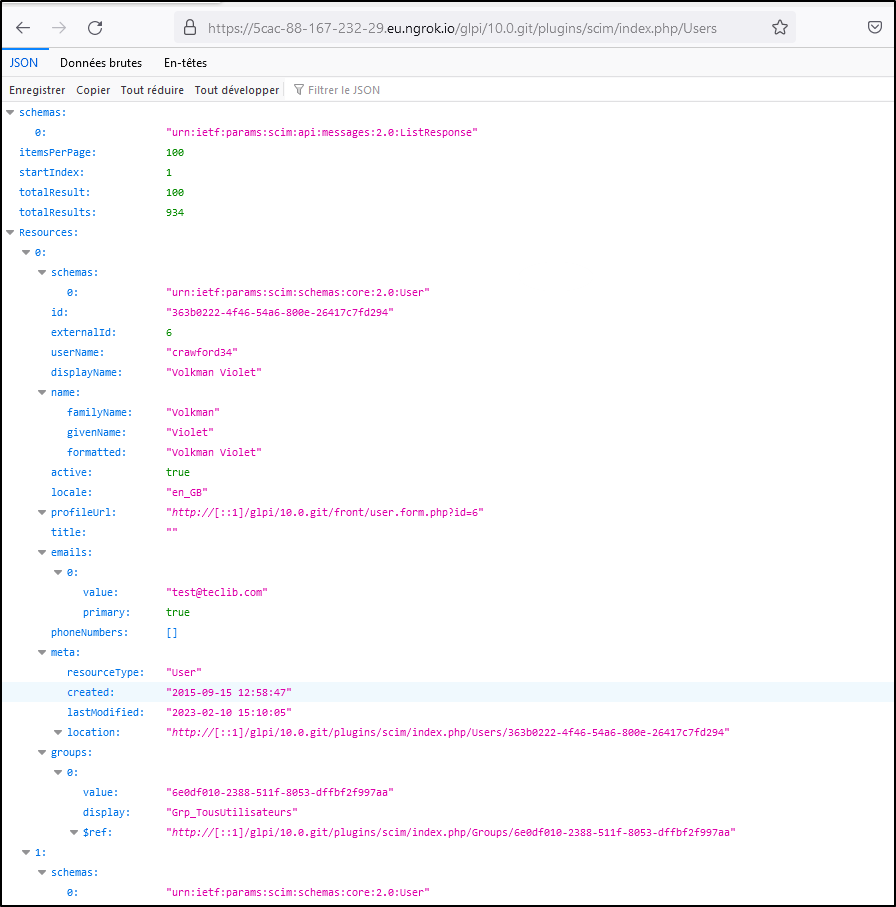

Setup GLPI
----------

You must declare an identity server in the plugin configuration (You can add any number).

- Go to your instance GLPI
- Select **Setup > SCIM Identity servers**
- Click **+ Add**
- Add a name
- Select the admin account who can update your GLPI's datas
- Click **Activate**
- Select the **Baerer** method
- click **+ Add**
- You can see now the API URL

.. Warning:: Make sure you **paste the token (Jwt token)** to ensure your application works properly.

You’ll be given an API url you may paste into your identity provider configuration. Check `specific provider documentation <#providers>`_ for more details.

You may set some optional parameters :

-  **Save requests in logs**: if checked, all requests will be saved in the “Historical” tab of your declared server.
-  **Default server**: if checked, this server will be used by default without providing it’s id in the API Url.
-  **Security**: a dropdown of available security methods. Currently implemented:

   -  **None**: no security, anyone can access the API.
   -  **Basic**: HTTP Basic authentication. You must provide a username and a password.
   -  **Digest**: HTTP Digest authentication. You must provide a username and a password.
   -  **Bearer**: HTTP Bearer authentication. A long lived (10years) jwt token will be generated.
   -  **OAuth2**: OAuth2 authentication. You must provide at least a valid redirection uri. We support the following flows:

      -  Authorization code.
      -  Client credentials.

Your SCIM server is now ready to receive requests from your identity provider.

