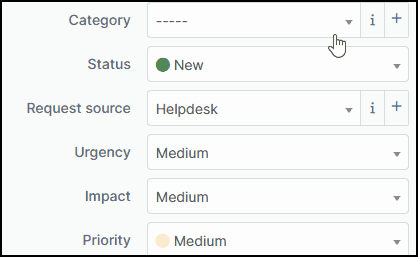
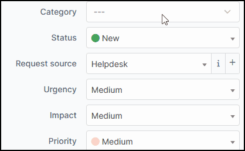

Splitcat
========

Requirements (on-premise)
-------------------------

============ =========== ===========
GLPI Version Minimum PHP Recommended
============ =========== ===========
10.0.x       8.1         8.2
============ =========== ===========

.. note::
   A `basic licence <https://services.glpi-network.com/#offers>`__ (or higher) is required. This plugin is also available from the `Cloud <https://glpi-network.cloud/fr/>`__.

Download the plugin
-------------------

-  From the marketplace (**Setup > Plugins**), download the **Splitcat** plugin

.. figure:: images/Splitcat-1.png
   :alt: install the plugin

Settings
--------

There are no special settings to be made for this plugin. You can see the effect of the plugin directly when you open a new ticket.

Before
~~~~~~

After
~~~~~

