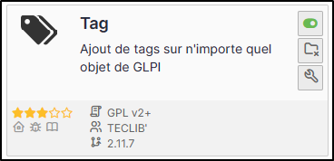
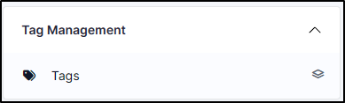
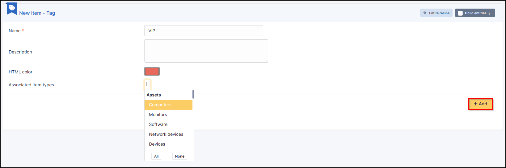
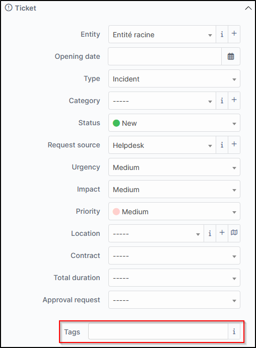
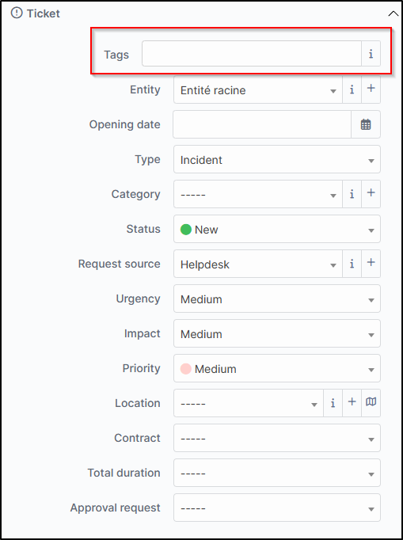
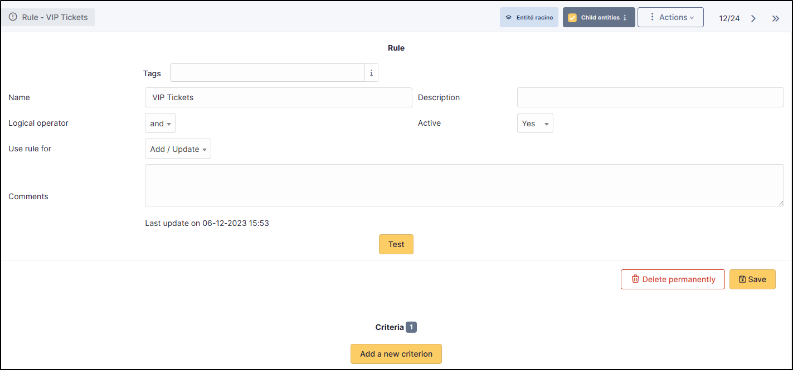
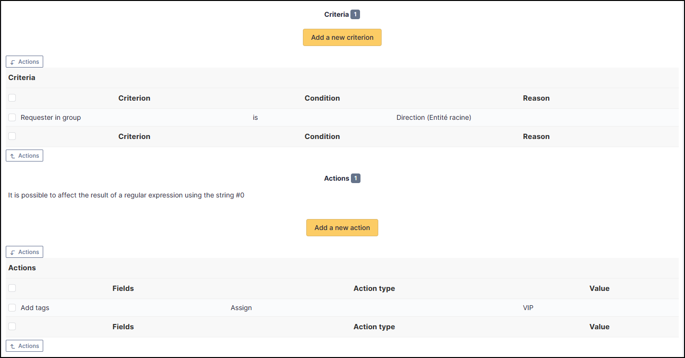
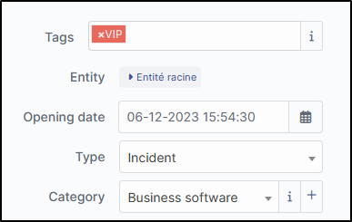

Tag
===

Requirements (on-premise)
-------------------------

============ =========== ===========
GLPI Version Minimum PHP Recommended
============ =========== ===========
10.0.x       8.1         8.2
============ =========== ===========

.. note::
   This plugin is available without a GLPI-Network subscription. It is also available in Cloud.

Sources
-------

- Sources link: https://github.com/pluginsGLPI/tag
- Download: https://github.com/pluginsGLPI/tag/releases

Install the plugin
------------------

-  Go to the marketplace. Download and install the plugin “**Tag**”.

Setting up the plugin
---------------------

-  From **Setup > Dropdowns**
-  Click on **Tag management**
-  Then **Tags**

-  Enter a name that will be visible when tags are added
-  Enter a description (optional)
-  Add a colour
-  Associate one or more elements. If nothing is ticked, it will not be
   visible in any element by default.

Choose where to find the tag
~~~~~~~~~~~~~~~~~~~~~~~~~~~~

You can indicate whether the tag should be at the top or bottom of the
list.

-  From **Setup > General > Tag management**, specify the tag location.

Bottom :

Top:

Adding rules
------------

You can add business rules (tickets, computers, etc.) to add tags to particular items.

Example : Assign a VIP tag when a member of the management group writes a ticket.

-  Here are the criteria to be implemented from **Administration > Rules > Business rules for tickets**

-  After creating a ticket :

.. note::
    Tags can, of course, be added manually if they have been set to be visible in the specified item.

