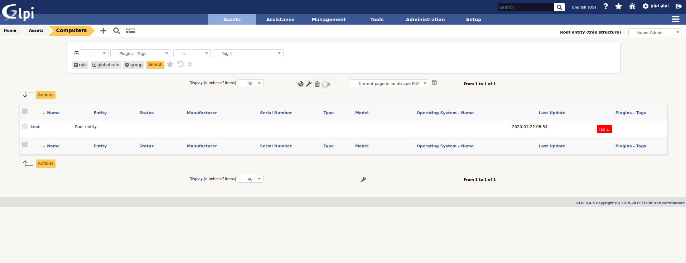

tag
========

* Sources link: https://github.com/pluginsGLPI/tag
* Download: https://github.com/pluginsGLPI/tag/releases

Requirements for latest version
-------------------------------

This plugin requires :

* PHP 7.2 or higher
* GLPI >= 9.4

Features
--------

* Add tags on every GLPI item type (which extends CommonDBTM)
* Add tags on FusionInventory Task (plugin fusioninventory)
* Add tags on Appliance (plugin appliance)
* Manage tag from labels
* Tags are displayed and editable in the object form header (just below title)
* You can search for tags and display them in objects lists
* You can display a report from associated objects in administration

Install the Plugin
------------------
* Uncompress the archive.
* Move the ``tag`` directory to the ``<GLPI_ROOT>/plugins`` directory
* Navigate to the *Configuration > Plugins* page,
* Install and activate the plugin.

Usage
-----

The plugin will create required tables in the database  automatically. Those tables will be updated along with the plugin.

Plugin usage is quite simple:

* Create tag

You will access the create form from the *Setup* > *Plugins* > *tag*.

Define ``name``, ``color``, ``sub-entities visibility`` and ``associated itemtype``

* Use tag

On associated itemtype, you can add tag previously created

.. image:: images/add_tag.png

* Search items by tag

You can easily find items with tag

* Get all items associated to tag

Go to tag form, clic on tab "Associated items"

