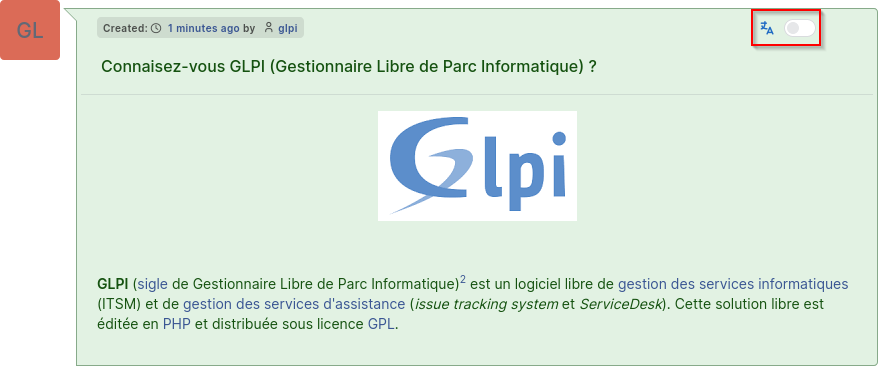
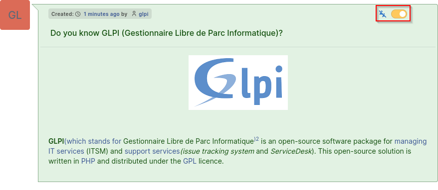
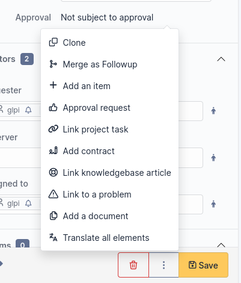
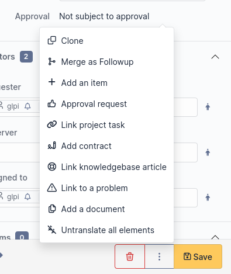
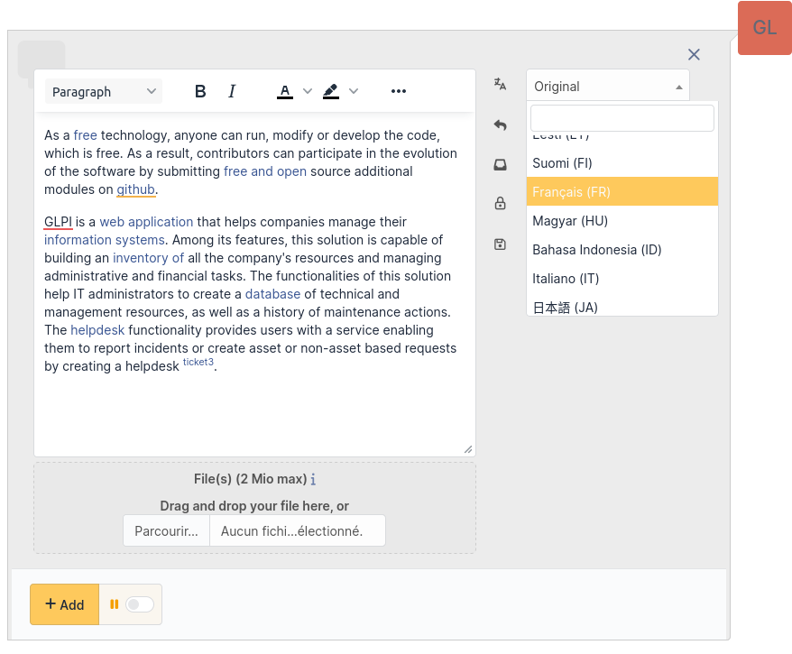
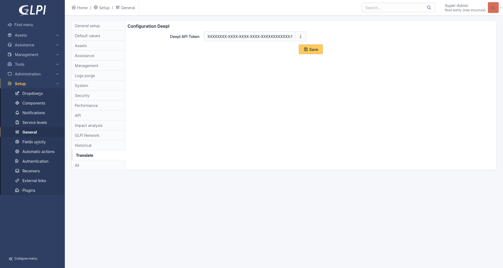

Translate
=========

Requirements (on-premise)
-------------------------

============ =========== ===========
GLPI Version Minimum PHP Recommended
============ =========== ===========
10.0.x       8.1         8.2
============ =========== ===========

.. note::
   A `basic licence <https://services.glpi-network.com/#offers>`__ (or higher) is required. This plugin is also available from the `Cloud <https://glpi-network.cloud/fr/>`__.

Introduction
------------

The **Translate** plugin for GLPI is a handy tool designed to enhance multilingual communication within your GLPI. Leveraging `DeepL <https://www.deepl.com/>`_'s translation technology, this plugin provides a simple and effective solution for translating elements in the ticket timeline, fostering seamless collaboration within international teams.

Whether you're managing projects with teams scattered worldwide or simply aiming to facilitate communication with users in different languages, the Translate plugin streamlines the translation process within your GLPI instance.

Features
--------

* Translate individual timeline elements
* Translate the entire ticket timeline
* Translate a follow-up during composition
* Restrict translation to specific languages
* Restrict translation to specific types of timeline elements
* API usage notification
* Translation rights management

Requirements
------------

* GLPI version 10.0.10 or higher
* DeepL API token

Operation
---------

Translating an Element
^^^^^^^^^^^^^^^^^^^^^^

Translation of a ticket element is done by activating the translation button located at the top right of the element. The target language will correspond to the user's preferred language.

..

    If the translation button does not appear, it may be due to various reasons:
        * the plugin is not configured
        * you do not have the right to translate
        * your preferred language is not allowed in the configuration
        * the element you want to translate is not allowed in the configuration

Undo Translation / Display Original Version
^^^^^^^^^^^^^^^^^^^^^^^^^^^^^^^^^^^^^^^^^^^

Once an element is translated, it will remain so until you request to undo the translation and display the original version. Displaying the original version is done through the same button used to translate an element, located at the top right of the element.

Translate Entire Timeline
^^^^^^^^^^^^^^^^^^^^^^^^^

It is possible to translate the entire timeline at once. To do this, display the additional options menu at the bottom right, next to the "Save" button. Then, click on "Translate all elements."

Undo Translations / Display Original Versions of Entire Timeline
^^^^^^^^^^^^^^^^^^^^^^^^^^^^^^^^^^^^^^^^^^^^^^^^^^^^^^^^^^^^^^^^

If all timeline elements are translated and you want to display their original versions, display the additional options menu at the bottom right, next to the "Save" button. Then, click on "Undo translation of all elements."

Translating a Follow-up during Writing
^^^^^^^^^^^^^^^^^^^^^^^^^^^^^^^^^^^^^^

It is possible to translate a follow-up before it is sent. To do this, write your follow-up and click on the drop-down menu at the top right of the follow-up editing window. Finally, select the language in which the follow-up's content should be translated.

Once your follow-up is translated, you can revert to the original text by selecting the "Original" option in the previous language selection menu.

This feature is also available for tasks, validation requests, and solutions.

..

    If the translation menu does not appear, it may be due to various reasons:
     * the plugin is not configured
     * you do not have the right to translate
     * the element you want to translate is not allowed in the configuration

Persistence of Translations
^^^^^^^^^^^^^^^^^^^^^^^^^^^

To reduce character consumption and improve plugin performance, translations are saved in the database. This approach allows sharing translations among all users, avoiding the need to translate the same element multiple times in the same language.

Translation requests from a user for an element are also saved, automatically displaying the translated version when returning to a ticket's timeline.

    If an element is modified, old translations will be considered obsolete. When a user requests a translation, a new translation will be performed for that element.

DeepL API Key
-------------

The **Translate** plugin uses the DeepL translation service. For this, a DeepL API key is required. DeepL offers two API plans, a free plan (limited to 500,000 characters per month) and a paid plan (at €4.99/month + €0.00002/character). Both plans are supported by the plugin.

Obtaining the API Key
^^^^^^^^^^^^^^^^^^^^^

1. Visit the DeepL website, "API" section (https://www.deepl.com/pro-api)

    .. image:: images/deepl_api_section.png
        :alt: DeepL API Section
        :scale: 35 %

2. Select a plan

    .. image:: images/deepl_select_plan.png
        :alt: Select Plan
        :scale: 35 %

3. Log in or create an account

    .. image:: images/deepl_login.png
        :alt: Log in or Create Accoun
        :scale: 35 %

4. Enter your personal informations

    .. image:: images/deepl_personal_informations.png
        :alt: Enter Personal Informations
        :scale: 35 %

5. Accept the terms of use and complete the registration

    .. image:: images/deepl_terms.png
        :alt: Accept Terms
        :scale: 35 %

6. Click on "Account management" to retrieve your API key

    .. image:: images/deepl_account_management.png
        :alt: Account Management
        :scale: 35 %

7. In the "Account" tab, retrieve your API key at the bottom of the page, in the "Authentication Key for DeepL API" section

    .. image:: images/deepl_retrieve_api_key.png
        :alt: Retrieve API Key
        :scale: 35 %

Configuration
-------------

Initial Configuration
^^^^^^^^^^^^^^^^^^^^^

After installing the plugin, it is necessary to enter a DeepL API key.

Consumption Configuration
^^^^^^^^^^^^^^^^^^^^^^^^^

    Some configuration options are only available if the API key is linked to the paid plan.

Usage
"""""

This progress bar allows you to monitor character consumption at the API level.

Allow Exceeding Limit
"""""""""""""""""""""

Allows setting or not setting a monthly limit on character consumption.

> This option is limited to the paid DeepL API plan.

**Usage Limit**

Allows setting the type of limitation:

- Characters: Limits usage to the number of characters
- Cost: Limits usage to cost

    This option is limited to the paid DeepL API plan.

**Per Characters / Per Cost**

Allows setting the consumption limit corresponding to the type defined above.

    For usage limited by cost, monthly subscription fees are not included.

..

    This option is limited to the paid DeepL API plan.

Maximum Number of Characters Translated per Translation
"""""""""""""""""""""""""""""""""""""""""""""""""""""""

Allows setting a maximum number of characters translated at once. This configuration is important and filters out overly large and resource-consuming elements for the API.

Notification Configuration
^^^^^^^^^^^^^^^^^^^^^^^^^^

Enable API Usage Notifications
""""""""""""""""""""""""""""""

Allows enabling API usage notifications. Once enabled, alert thresholds are configurable using the "Usage Threshold" fields.
Default value: Yes

Usage Threshold
"""""""""""""""

This option allows setting usage alert thresholds. Requires enabling the "Enable API Usage Notifications" option.
Default values: 25%, 50%, 75%, 100%

User Configuration
^^^^^^^^^^^^^^^^^^

Allowed Target Languages for All Users
""""""""""""""""""""""""""""""""""""""

| Defines the languages in which elements can be translated by all users.
| Default values: Languages proposed by DeepL

Allowed Translatable Elements for All Users
"""""""""""""""""""""""""""""""""""""""""""

| Defines the elements that can be translated by all users.
| Default values: Ticket, Follow-up, Ticket Task, Solution, Validation Request

Rights
------

Allow translation of displayed elements (language configured in preferences)
^^^^^^^^^^^^^^^^^^^^^^^^^^^^^^^^^^^^^^^^^^^^^^^^^^^^^^^^^^^^^^^^^^^^^^^^^^^^

This right defines whether a profile can translate timeline elements of a ticket (Ticket, Follow-up, Task, Solution, Validation Request).

Allow translation while writing
^^^^^^^^^^^^^^^^^^^^^^^^^^^^^^^

This right defines whether a profile can translate the content of a follow-up before sending.

FAQ
---

If you have any questions about using the plugin, please consult `our faq <https://faq.teclib.com/04_Plugins/Translate/>`__