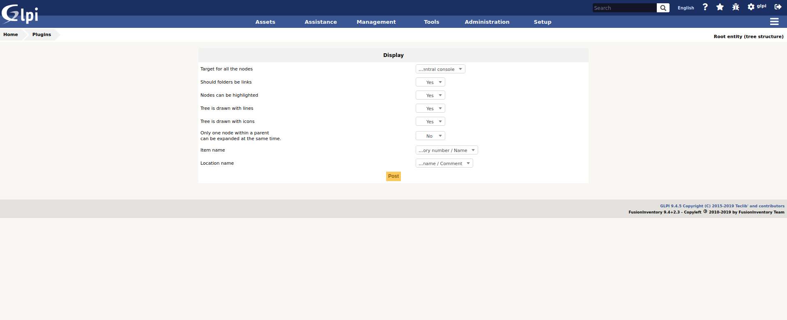

Treeview
========

Sources
-------

* Sources link: https://github.com/pluginsGLPI/treeview
* Download: https://github.com/pluginsGLPI/treeview/releases

Requirements for latest version
-------------------------------

Requirements (on-premise)
-------------------------

============ =========== ===========
GLPI Version Minimum PHP Recommended
============ =========== ===========
10.0.x       8.1         8.2
============ =========== ===========

.. Note::
   This plugin is available without a GLPI-Network subscription. It is also available in `Cloud <https://glpi-network.cloud/>`__

Features
--------

This plugin allows you to browse through your inventory via a tree view in a panel located on the left side of the screen.

You can browse the tree of your site to see the equipment.

Install the Plugin
------------------
* Uncompress the archive.
* Move the ``tag`` directory to the ``<GLPI_ROOT>/plugins`` directory
* Navigate to the *Configuration > Plugins* page,
* Install and activate the plugin.

Usage
-----

The plugin will create required tables in the database  automatically. Those tables will be updated along with the plugin.

Plugin configuration is quite simple:

You will access the create form from the *Setup* > *Plugins* > *treeview*.

* Target for all node : on clic  on node, redirect to new window
* Nodes can be highlighted : highlight selcted node or not
* Tree is drawn with lines : display or not
* Tree is drawn with icons : Display or not icon for node
* Only one node within a parent can be expanded at the same time : more tthan one parent node can be expand at same time
* Item name : name or inventory number or name + inventory number or inventory number + name
* Location name : short name or long name or long name + comment or long name + comment