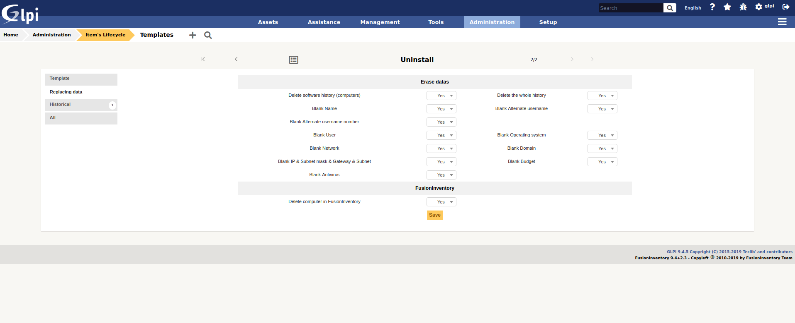
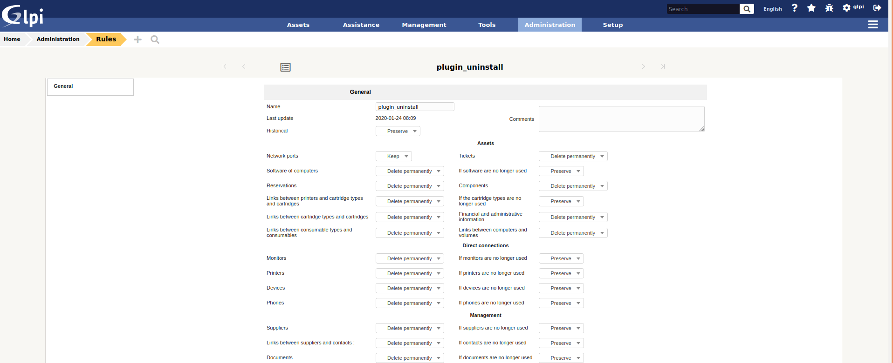
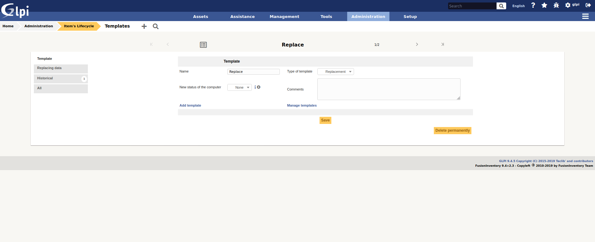
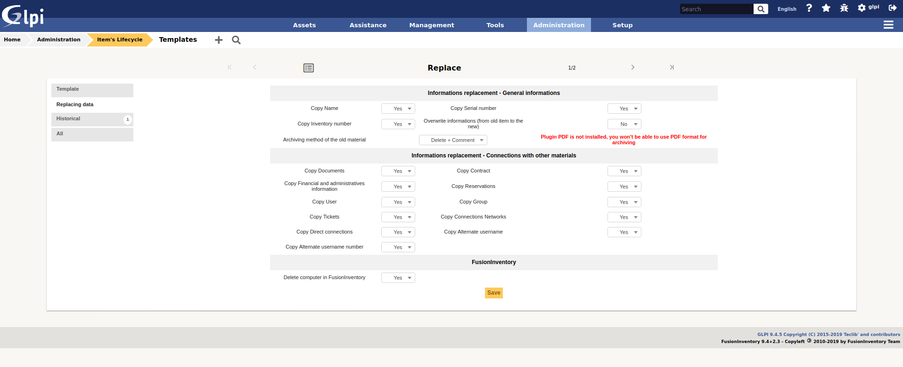
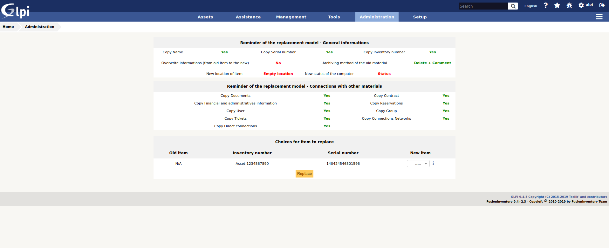

Uninstall
=========

Sources
-------

* Sources link: https://github.com/pluginsGLPI/uninstall
* Download: https://github.com/pluginsGLPI/uninstall/releases

Requirements (on-premise)
-------------------------

============ =========== ===========
GLPI Version Minimum PHP Recommended
============ =========== ===========
10.0.x       8.1         8.2
============ =========== ===========

.. Note::
   This plugin is available without a GLPI-Network subscription. It is also available in `Cloud <https://glpi-network.cloud/>`__

Features
--------
This plugin, named "uninstall" or "Item Uninstallation", allows you to remove / replace devices from the inventory by automating certain actions on the fields.

It allows to manage the different stages of the life cycle of a hardware.
It has been designed, among other things, to handle the following cases:

* scrapping of equipment
* removal from inventory of temporary equipment due to breakdown
* Replacement of equipment under a warranty for example (See: Replacement Equipment Feature)

Once installed, the plugin includes :

* a rights management directly accessible from Administration -> Profiles (in the Plugins tab -> uninstall),
* a "hardware uninstall" menu in "Configuration",
* an "uninstall" menu in the user preferences.

Right managment
---------------

It is possible to deny access to the plugin or to allow it by specifying the read or write option on the templates.

To do this, simply go to the menu "Administration" > "Profiles",
to select the profile you wish to modify,
then in the "Uninstallation" tab set the following options :

* *No access*: the plugin does not appear in the menu 'Plugin'.
* *Playback*: only the use of previously created templates is possible
* *Writing*: Template creation is possible.
* *Hardware replacement*: standard hardware replacement is possible

Uninstall feature
-----------------

This functionality of the plugin 'Item Uninstallation' adds the possibility of modifying the value of certain fields and of removing the inventory of a computer of the OCS base or the cleaning of the FusionInventory tables.

The uninstall templates can be accessed in the "Administration > Uninstall Hardware" menu. 

You can create as many uninstall templates as you want.
Each template can contain different features, and be visible in the sub-entities or not.

Uninstall equipment is a transfer of the equipment to itself. During its transfer, a certain number of actions are performed, as specified in the definition of transfer.

* *Name*: the name of the uninstall template
* *Sub-entities*: indicates whether the template is visible in the creation entity and its sub-entities
* *Model type*: indicates which type of model should be used (either Uninstall or Replace)
* *Comments*: free fields to add details about the model
* *Transfer template to be used*: Indicates the transfer template to be used when uninstalling the system.
* *New hardware status*: indicates which status the hardware should take once uninstalled
* *New group*: indicates the group to which the hardware can belong once uninstalled.

* *Software History Deletion* : Allows deletion of all lines in a computer's history that are relevant to software installations/uninstallations.
* *REMOVE Name* : removes the name of the hardware during uninstallation

* *RAZ Contact* : removes the contact reassembled by OCS during uninstallation
* *Network reset*: resets the "network" field of the equipment record to zero.
* *RAZ OS*: Removes OS information (OS, Version, Service Pack, Product Key, Product ID) when uninstalling.
* *RAZ domain* : removes the "domain" field from the hardware
* *Remove IP & Gateway & Hacker & Subnet*: removes network information (except for the MAC address, which is hardware-related) during uninstallation
* *Remove the machine from OCS* : when uninstalling a computer in GLPI, remove from the OCS base the corresponding machine
* *Delete FusionInventory info*: Delete all FusionInventory info for this material

Uninstall hardware
------------------

There are 2 possibilities to uninstall a hardware:

* from its file, in the tab "Uninstallation".
* from the massive modifications list

Since a template can be recursive (visible in the sub-entities), the list of templates displayed in the massive actions indicates all the templates available in the current entity (either those defined in this entity, or in an entity above it and visible in the sub-entities).

Change of location on uninstallation
^^^^^^^^^^^^^^^^^^^^^^^^^^^^^^^^^^^^

It is possible to change the location of the hardware once it has been uninstalled.
This selection is made either :

* in the hardware file, once the uninstallation model has been chosen.
* from the user's preferences for uninstallation by massive modification

It should be noted that a location is declared within an entity. It is therefore possible, depending on the current entity, to define an uninstall location.

Replace feature
---------------

This feature of the 'Item Uninstallation' plugin adds the possibility to replace one hardware by another.

Replacement Model Form
^^^^^^^^^^^^^^^^^^^^^^

Replacement models are managed in the same way as uninstall models:
They are accessible in the menu "Administration > Uninstall hardware".
Each model can contain different characteristics, and be visible in the sub-entities or not.

In this form there are 4 tabs :
* Main: allows to display on the page only the main information of the template.
* Replacing data: displays the various actions to be performed when replacing one piece of equipment with another.
* All: displays all the tabs on the same page

Here is the description of the fields of the main tab :

*Name*: the name of the replacement model
*Sub-entities*: indicates whether the template is visible in the creation entity and its sub-entities
*Model type*: indicates what type of model should be used (here we are talking about type - Replacement)
*Comments*: free fields to add details about the model
*New hardware status*: indicates which status the old hardware should take once it has been replaced

Replacing data tab
^^^^^^^^^^^^^^^^^^

Here is the description of the fields of the actions tab.

 *General Information*

* *Copy name*: allows you to define if you want to copy the name of the old hardware to the new one.
* *Copy the serial number*: Allows you to define if you wish to copy the serial number of the old equipment to the new one.
* *Copy the inventory number*: allows you to define if you want to copy the inventory number of the old equipment to the new one.
* *Overwrite information* (from the old material to the new one): this option allows you to choose the behavior to adopt if one of the unique information (Reservation, Financial Information, Name, Serial, Otherserial, Entity...) is present in the old material AND in the new material : *Yes* : by selecting YES, the information in the old material will replace that in the new material. *No*: by selecting NO, the information of the new hardware will NEVER be overwritten by the information of the old hardware.

*Method of archiving old material*

In this option, we define the behavior that the uninstall plugin must adopt with the old hardware :

* *Purge + PDF / CSV*: if you have the PDF plugin the old hardware will be purged from the GLPI database and its information will be attached to the new hardware in a PDF document. If you do not have the PDF plugin, they will be stored in CSV format.
* *Deletion + Comments*: the old hardware is put in the trash and a comment is added in each of the two hardware ("This hardware has been replaced by..." and "This hardware has replaced the hardware...").

*Data location - Connection with other hardware*

* *Copy Documents*: Allows you to attach documents from old equipment to new equipment.
* *Copy Contracts*: allows you to attach the contracts from the old equipment to the new equipment.
* *Copy financial information*: allows you to attach financial information from the old equipment to the new equipment. Warning: if the "Overwrite information" option is activated, even if the new hardware has financial information, it will be replaced by the old hardware.
* *Copy Reservations*: Allows you to attach the reservations made on the old equipment to the new equipment. Attention: same remark as for the financial information.
* *Copy the user*: allows you to pass on the user of the old equipment to the new one. Caution: same remark as for the financial information.
* *Copy group*: Allows you to assign the group of the old equipment to the new equipment. Caution: same remark as for the financial information.
* *Copy the tickets*: Allows you to attach the tickets of the old equipment to the new equipment.
* *Copy network connections*: Allows you to transfer the network connections from the old hardware to the new hardware.
* *Copy direct connections*: Allows you to transfer the direct connections (Monitor, Printer, Device, Phone) from the old hardware to the new hardware.

Replace hardware
----------------

As well as uninstalling equipment, there are two ways to replace equipment:

* from the card of this one, in the tab "Plugins -> Uninstallation",
* from the massive modification list.

Since a replacement template can be recursive (visible in the sub-entities), the list of templates displayed in the massive actions indicates all the templates available in the current entity (either those defined in this entity, or in an entity above it and visible in the sub-entities).

Once you have selected the hardware to be replaced via the massive actions, or you use the "Uninstall" tab directly in it :

* a summary of the selected template appears in order to show you the actions that will be performed by the plugin.
* the list of the selected hardware(s) appears and you can choose the replacement hardware in the same way as when you choose a hardware in a Support Ticket.

Change of location on replacement
^^^^^^^^^^^^^^^^^^^^^^^^^^^^^^^^^

It is possible to change the location of the equipment once it has been replaced.
This selection is made either :
* in the equipment sheet, once the replacement model has been chosen,
* from the user's preferences for massive modification replacement.

Note that a location is declared within an entity. It is therefore possible, depending on the current entity, to define a replacement location.