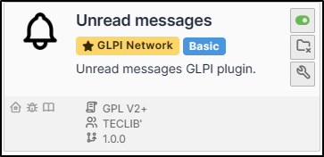
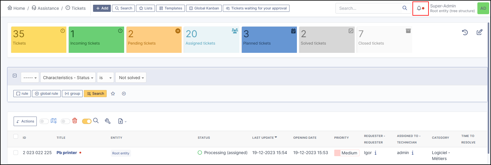
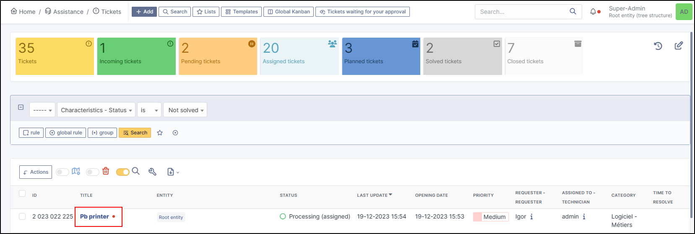
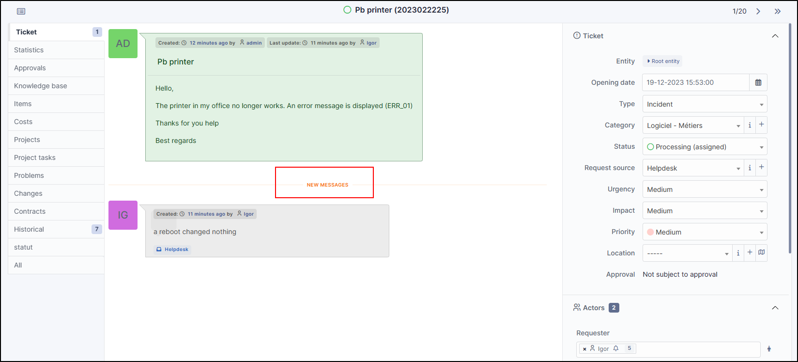
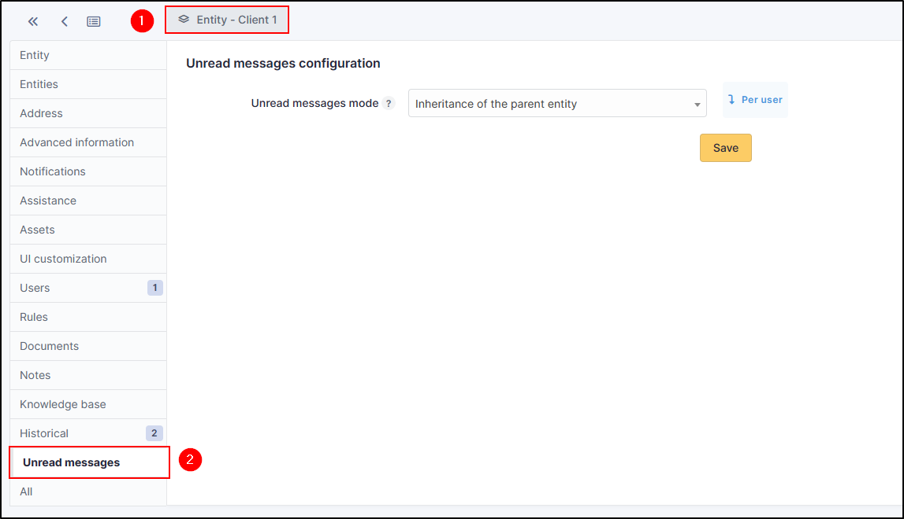

Unread messages
===============

Requirements (on-premise)
-------------------------

============ =========== ===========
GLPI Version Minimum PHP Recommended
============ =========== ===========
10.0.x       8.1         8.2
============ =========== ===========

.. note::
   A `basic licence <https://services.glpi-network.com/#offers>`__ (or higher) is required. This plugin is also available on `Cloud <https://glpi-network.cloud/fr/>`__.

Install the plugin
------------------

-  Go to the marketplace. Download and install the plugin **Unread messages**.

Setting up the plugin
---------------------

-  Go to **Administration > Entities**, **unread messages** tab

There are 3 possible settings:

+----------------------------------------+-----------------------------+
| Operation                              | Effect                      |
+========================================+=============================+
| **Disabled**                           | The plugin will remain      |
|                                        | inactive                    |
+----------------------------------------+-----------------------------+
| **Per user helpdesk;share central**    | Users with the self-service |
|                                        | profile will be notified of |
|                                        | tickets for which they are  |
|                                        | the requestor. Technicians, |
|                                        | for their part, will share  |
|                                        | the notifications. If a     |
|                                        | notification is read, it    |
|                                        | will be marked as read for  |
|                                        | all other technicians       |
+----------------------------------------+-----------------------------+
| **Per user**                           | Each user will have access  |
|                                        | to their own queue of       |
|                                        | notifications, including    |
|                                        | those for their group and   |
|                                        | their individual            |
|                                        | assignments                 |
+----------------------------------------+-----------------------------+

Display notifications
---------------------

Header
~~~~~~

When a new activity has not yet been viewed, a :bell::point-filled: icon appears:

Listed
~~~~~~

Unread messages on a ticket highlight the ticket concerned and a red
indicator :

Ticket timeline
~~~~~~~~~~~~~~~

New messages will be identified by a banner **New messages**.

Management by entity
~~~~~~~~~~~~~~~~~~~~

Management by entity is possible to manage the counting of notifications by entity.

- Go to **Administration > Entities**, and select the desired entity.
- In the **Unread messages** tab, select the option that suits you so that unread messages behave differently to the parent entity.

