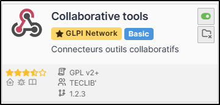
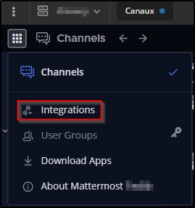
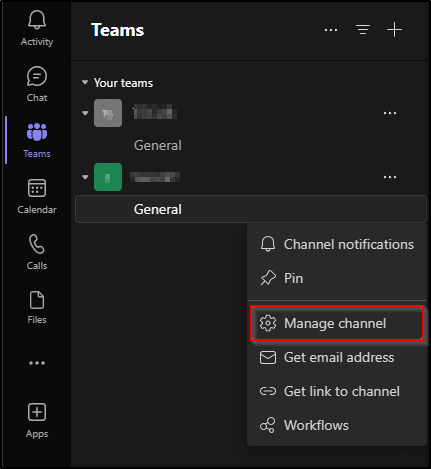
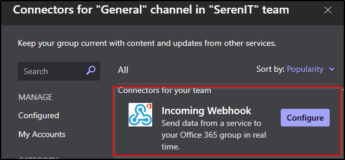
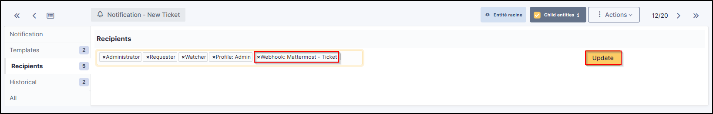
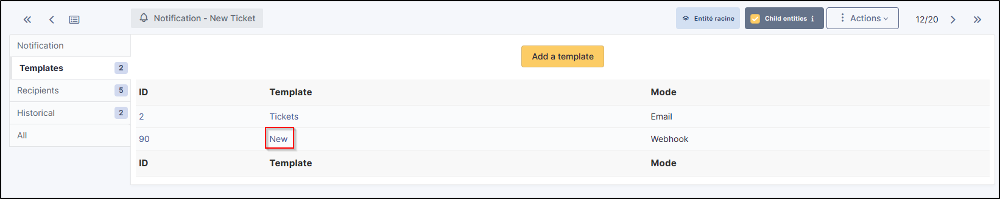

Collaborative tools
===================

Requirements (on-premise)
-------------------------

============ =========== ===========
GLPI Version Minimum PHP Recommended
============ =========== ===========
10.0.x       8.1         8.2
============ =========== ===========

.. note::
   A `basic licence <https://services.glpi-network.com/#offers>`__ (or higher) is required. This plugin is also available on `Cloud <https://glpi-network.cloud/fr/>`__.

Install the plugin
------------------

-  Go to the marketplace. Download and install the plugin **Collaborative tools**.

Activate webhooks
-----------------

-  In the tab **Setup > Notifications** activate Webhooks notifications

Add a Webhook
-------------

Mattermost
~~~~~~~~~~

-  From a Mattermost administrator account, go to the menu at the top left,
-  Then Integrations

-  Select **Incoming Webhooks**
-  Then **Add a new incoming webhook**.

.. figure:: images/Webhook-4.png
   :alt:

.. figure:: images/Webhook-5.png
   :alt:

-  Fill in the necessary fields and select the channel that will receive the notifications
-  Then click on **Save**.

.. figure:: images/Webhook-15.png
   :alt:

-  You will then be sent the link to your Webhook:

.. figure:: images/Webhook-16.png
   :alt:

Teams
~~~~~

-  From a Teams administrator account, go to the channel that will receive GLPI notifications
-  Click on the channel menu
-  Then **Manage channel**

-  In the **Connectors** section,
-  click on **Modify**

.. figure:: images/Webhook-11.png
   :alt:

-  From the **incoming Webhook connector**
-  click on **Configure**

-  Enter a name for your webhook and an image (optional)
-  Click on **Create**

.. figure:: images/Webhook-13.png
   :alt:

-  You will then be sent the URL of your webhook

.. figure:: images/Webhook-14.png
   :alt:

Telegram
~~~~~~~~

-  From Telegram, start a new chat with the bot **@BotFather** and run the following command **/newbot**
-  Answer the few questions you will be asked to set up your bot
-  Once finished, a token will be sent to you:

.. figure:: images/Webhook-17.png
   :alt:

-  If you have already created a dedicated channel to receive GLPI notifications, add your bot to it.
-  Otherwise, create your own channel
-  add the newly created bot

-  Send a message in the channel created to initiate a conversation and generate the various IDs we will need.

-  From your browser, enter the following URL:

   https://api.telegram.org/botmytoken/getupdates\

Replace *mytoken* with the value of the token generated above

.. note::
   Telegram bot URLs take the form **https://api.telegram.org/bot{mytoken}**

-  You should see a similar result:

.. code:: yaml

       "ok": true,
       "result": [
           {
               "update_id": 816584684,
               "my_chat_member": {
                   "chat": {
                       "id": -541684658463,
                       "title": "GLPI Ticket",
                       "type": "channel"
                   },
                   "from": {
                       "id": 1546610935,
                       "is_bot": false,
                       "first_name": "xxxxxxx",
                       "last_name": "xxxxxxx"

                  },
                   "new_chat_member": {
                       "user": {
                           "id": 7468746847,
                           "is_bot": true,
                           "first_name": "glpi",
                           "username": "xxxxxx_bot"

-  In the **my_chat_member** copy the **ID** value of the **chat**.

.. Warning::
   The negative sign **-** must also be copied

Slack
~~~~~

- As a logged team administrator, go to the administration menu
- click on Integrations menu item
- Click on the New integration button
- Select incoming webhooks, and define webhook parameters
- After save, you will get the url of the webhook.

Rocket
~~~~~~

- You need to add an application to your team (the link is present in the bottom of the left side bar) and select incoming-webhook
- Add a new configuration, select the channel where you want notifications and you will get the webhook url.
- You can optionally setup a name and a logo for your hook.

Set up the webhook in GLPI
--------------------------

-  Fill in the requested information and select the channel on which you
   want the notifications to be sent.
-  Once registered, a link will be sent to you. Copy this link and
   transfer it to **Setup > Notifications > Configuration of notifications by webhooks**

-  Click on + and enter :

   -  Webhook name,
   -  the type,
   -  the URL.

.. figure:: images/Webhook-7.png
   :alt:

-  Click on **Add**

.. Warning::
   For Telegram, you will need to re-enter the webhook and add the **chat_id** you selected earlier
   .. figure:: images/Webhook-18.png
   :alt:

-  You can test how it works by selecting your webhook and clicking on **Send notification**

.. figure:: images/Webhook-8.png
   :alt:

Recipients
----------

-  You now need to determine which notifications will be affected by the
   sending of a Webhook and assign them a template.
-  Go to **Setup > Notifications > Notifications**
-  Select the 1st notification concerned by Webhooks (here **New ticket**)
-  In the **Recipients** tab, add your Webhook then **Update**.

Templates
---------

-  In the tab **Templates** click **Add a template**
-  Choose **Webook** in the **Notification method** and **New** in the **Notification template**

 Your Webhook is ready to use. You can customise the template by clicking on **New** so that it matches your requirements.

