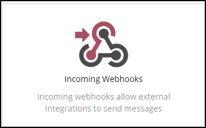
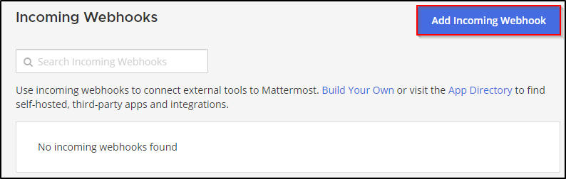
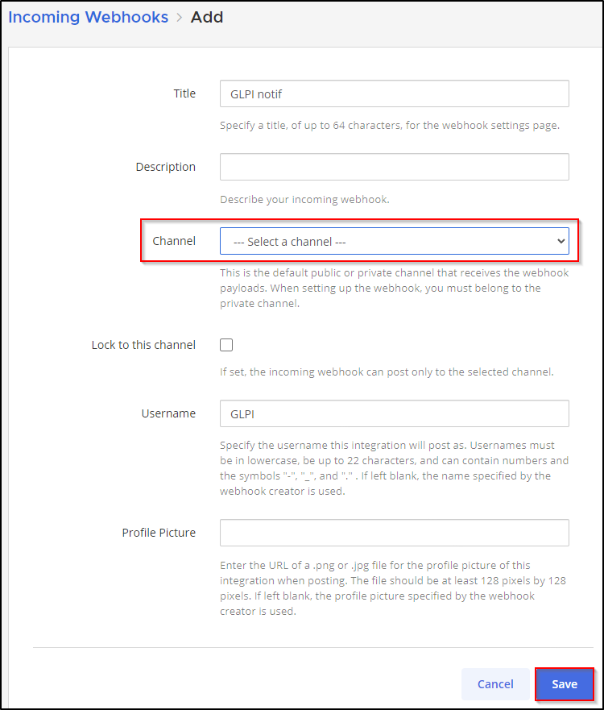
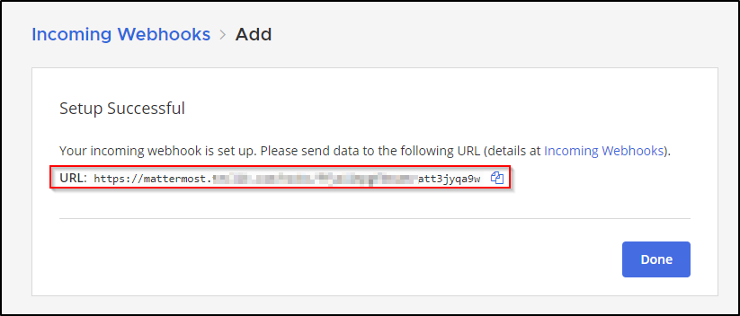

Mattermost
----------

-  From a Mattermost administrator account, go to the menu at the top left,
-  Then Integrations

.. figure:: images/Webhook-3.png
   :alt: integrations
   :scale: 100 %

-  Select **Incoming Webhooks**
-  Then **Add a new incoming webhook**.

-  Fill in the necessary fields and select the channel that will receive the notifications
-  Then click on **Save**.

-  You will then be sent the link to your Webhook:

- Go to :doc:`setup the webhook in GLPI <setup_glpi>`