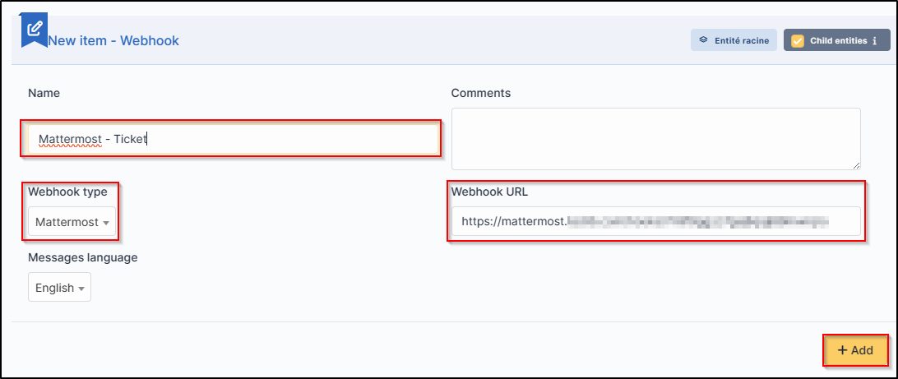
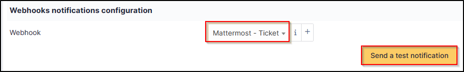

Set up the webhook in GLPI
--------------------------

-  Fill in the requested information and select the channel on which you
   want the notifications to be sent.
-  Once registered, a link will be sent to you. Copy this link and
   transfer it to **Setup > Notifications > Configuration of notifications by webhooks**

-  Click on + and enter :

   -  Webhook name,
   -  the type,
   -  the URL.

-  Click on **Add**

.. Warning::

   For Telegram, you will need to re-enter the webhook and add the **chat_id** you selected earlier

   .. figure:: images/Webhook-18.png
      :alt: paste chat_ID
      :scale: 40 %
      :align: center

-  You can test how it works by selecting your webhook and clicking on **Send notification**

Recipients
----------

-  You now need to determine which notifications will be affected by the
   sending of a Webhook and assign them a template.
-  Go to **Setup > Notifications > Notifications**
-  Select the 1st notification concerned by Webhooks (here **New ticket**)
-  In the **Recipients** tab, add your Webhook then **Update**.

.. figure:: images/Webhook-19.png
   :alt: setup recipients
   :scale: 43 %

Templates
---------

-  In the tab **Templates** click **Add a template**
-  Choose **Webook** in the **Notification method** and **New** in the **Notification template**

 Your Webhook is ready to use. You can customise the template by clicking on **New** so that it matches your requirements.

.. figure:: images/Webhook-20.png
   :alt: custom notification
   :scale: 45 %
