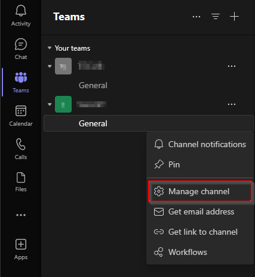
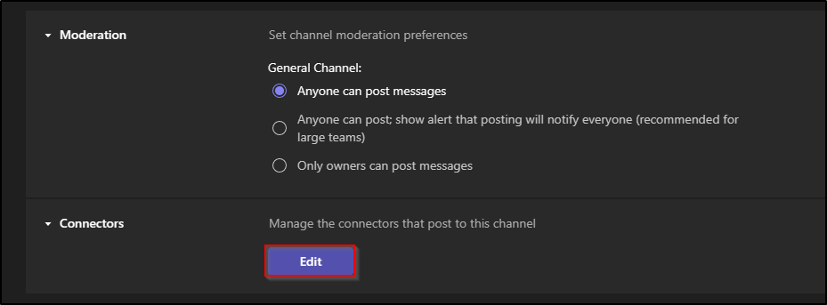
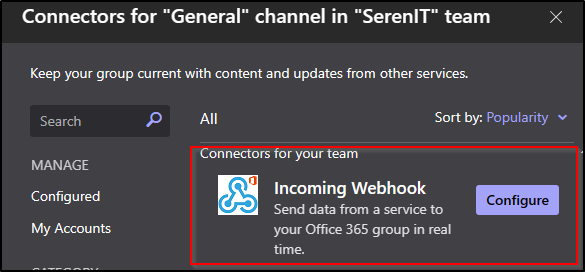
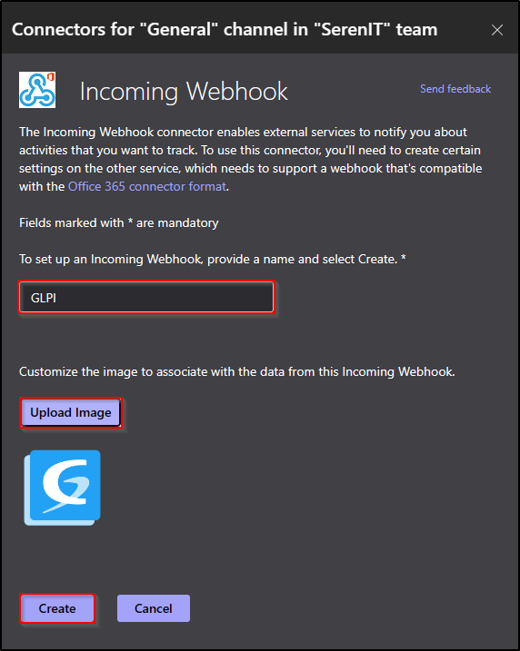
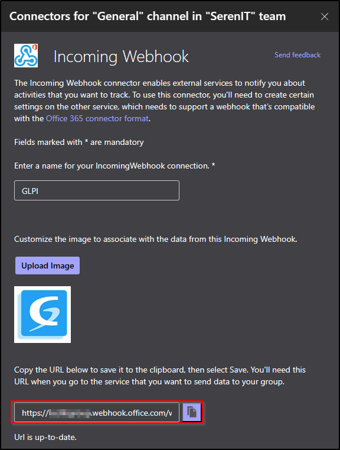
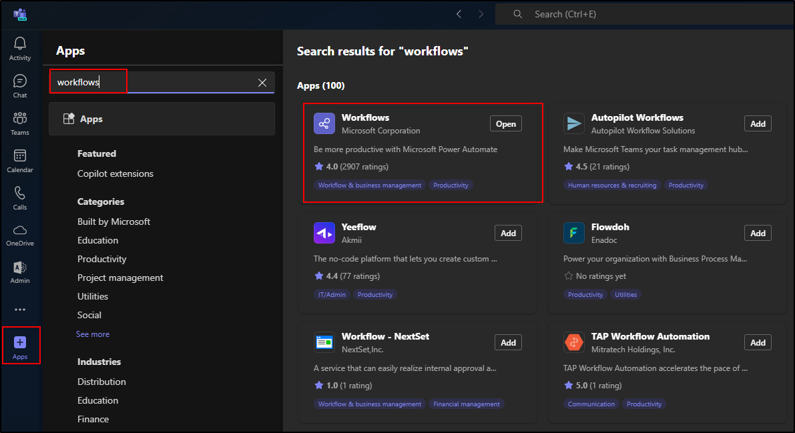
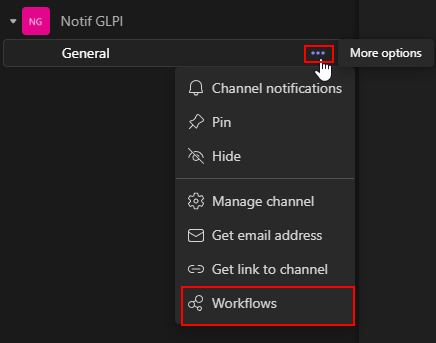
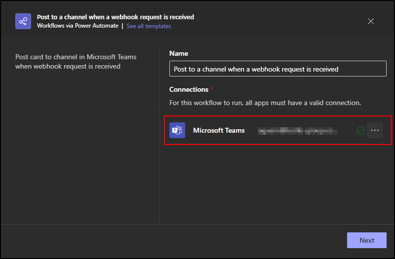
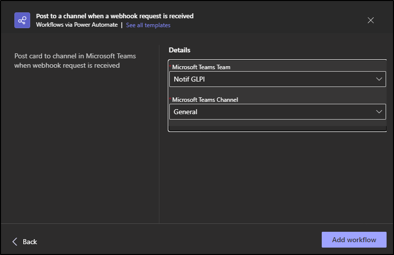
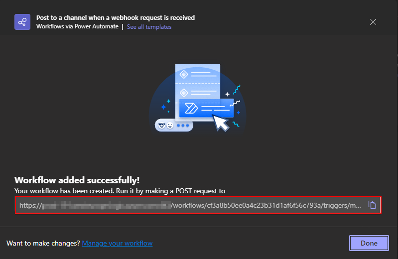

Teams
-----

-  From a Teams administrator account, go to the channel that will receive GLPI notifications
-  Click on the channel menu
-  Then **Manage channel**

-  In the **Connectors** section,
-  click on **Modify**

-  From the **incoming Webhook connector**
-  click on **Configure**

-  Enter a name for your webhook and an image (optional)
-  Click on **Create**

-  You will then be sent the URL of your webhook

.. Warning:: Following the end of O365 connectors, Microsoft is imposing a new method of setting up your webhooks using workflows.
   This procedure must be implemented before 15 August. After this date, your webhooks will no longer be able to function.
   Your webhooks used by incoming Webhooks (old method) will no longer be available

.. Note:: The channel used must be public. Microsoft does not currently allow webhooks with Workflows from a private channel.

- From **Teams**, go to **Apps**
- In the search box, enter **Workflows**
- In the list of applications, click on **Add**

.. Note:: Some information may take a while to appear, so please be patient between each step and wait for the information
   to appear on the screen before moving on to the next step.

- From the desired Teams channel, click on the **···** menu

- Click on **Workflows**
- Choose "**Post to a channel when a webhook request is received**"
- In the new window, make sure that the current account has a sufficient licence to send webhooks

- Teams will give you a summary of the selected channel. If you've got it right, click on Add Workflows

- The URL of your workflow appears. Copy it and keep it, it will be used to configure GLPI.

- Go to :doc:`setup the webhook in GLPI <setup_glpi>`

