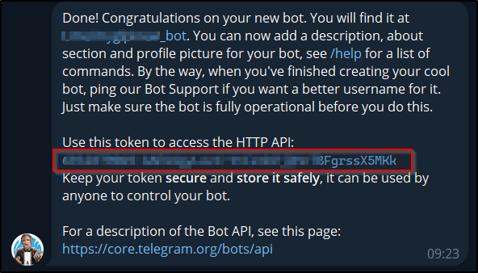

Telegram
--------

-  From Telegram, start a new chat with the bot **@BotFather** and run the following command **/newbot**
-  Answer the few questions you will be asked to set up your bot
-  Once finished, a token will be sent to you:

-  If you have already created a dedicated channel to receive GLPI notifications, add your bot to it.
-  Otherwise, create your own channel
-  add the newly created bot

-  Send a message in the channel created to initiate a conversation and generate the various IDs we will need.

-  From your browser, enter the following URL:

   https://api.telegram.org/botmytoken/getupdates\

Replace *mytoken* with the value of the token generated above

.. note::
   Telegram bot URLs take the form **https://api.telegram.org/bot{mytoken}**

-  You should see a similar result:

.. code:: yaml

       "ok": true,
       "result": [
           {
               "update_id": 816584684,
               "my_chat_member": {
                   "chat": {
                       "id": -541684658463,
                       "title": "GLPI Ticket",
                       "type": "channel"
                   },
                   "from": {
                       "id": 1546610935,
                       "is_bot": false,
                       "first_name": "xxxxxxx",
                       "last_name": "xxxxxxx"

                  },
                   "new_chat_member": {
                       "user": {
                           "id": 7468746847,
                           "is_bot": true,
                           "first_name": "glpi",
                           "username": "xxxxxx_bot"

-  In the **my_chat_member** copy the **ID** value of the **chat**.

.. Warning::
   The negative sign **-** must also be copied

- Go to :doc:`setup the webhook in GLPI <setup_glpi>`